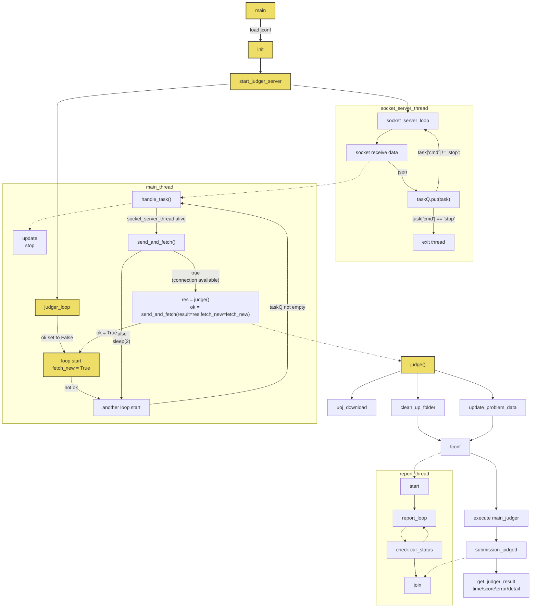

# UOJ阶段总结(1) 搭建环境
## 杂七杂八的学习
### 1.关于docker
* 类似虚拟机，可以非常方便地创建系统镜像并装载，对于像我这种装东西之后容易忘记卸而导致环境越来越脏的家伙来说还是很方便的。
* docker的镜像一般自动在dockerhub上的源下载，有点类似git
* docker的image是静态的，如果运行需要创建容器并装载
* container被干掉对image没有影响，但是装载时就仍然是image的状态了，这点和git也是相同的
* 一些常用基本命令
start container
attach container
rename container
commit container
tag image
run image
* docker run 目前接触到的参数
-p [port1]:[port2]  [port3]:[port4] ...对端口的映射
--add-cap 添加配置（这一点很坑，一开始就没给权限导致gdb无法运行然后ce）
--name="name"  
-it   等价与马上attach新产生的容器
### 2. 关于subversion
* 和git不太一样，中心式的，每次ci都是传给服务器
* svn只是在第一次co的时候需要认证，之后根据uuid可以省去认证
* 服务器端权限配置
1. 在项目目录的“conf/”目录下面有.conf文件,记录对于不同类型用户的主要权限、密码数据库和authez数据库（其实就是文本文件）的路径
权限主要就是none、read、write
```
anon-access = none
auth-access = write
password-db = passwd
```
2. 数据库

1)密码数据库就是 user=passwd 的格式:
```
[users]
our-root = abc
userA = 666
```
2)authez数据库是对权限的细分:
```
[aliases]
# joe = /C=XZ/ST=Dessert/L=Snake City/O=Snake Oil, Ltd./OU=Research Institute/CN=Joe Average
# 分组信息
[groups]
harry_and_sally = harry,sally
harry_sally_and_joe = harry,sally,&joe

#/foo/bar 目录：harry可以读写，joe可以读, 其他人不给权限
[/foo/bar]
harry = rw
&joe = r
* =
#/baz/fuz 目录：harry_and_sally可以读写，其他人只能读
[repository:/baz/fuz]
@harry_and_sally = rw
* = r
```
* 客户端常用命令
svn co [svn_path]
svn add [file_path]
svn commit
svn ci 
svn up
### 3. mysql
这里必须吐槽下我自己的蠢，一开始对docker不了解居然自己机子又去装了mysql。

数据库命令大同小异，其他的就是一些特殊函数，要用时候百度就好了
## 初步了解UOJ
### judge client工作流程图

