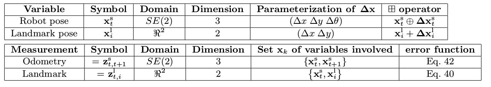

# G2O
## 基本算法
* 用高斯牛顿法加上递归速度参数保证稳定下降
* 解方程用外部库(PCG/舒尔分解)加速
* 选择核函数增加鲁棒性
* 需要自己处理输入的格式规范
* 可以使用ceres
## data structure
### Overview

### BaseVertex
需要实现
| function             | usage          |
|:---------------------|:---------------|
| oplusImpl(double* v) | 扰动叠加操作符 |
| setToOriginImpl()    | 归位操作符     |
而成员变量 **_estimate** 则作为预测量
### BaseUnaryEdge
模板实例化需要
1. vertex的类型
2. error的类型
3. error的维数
需要实现

| function       | usage    |
|:---------------|:---------|
| computeError() | 计算误差 |

* 自己实现了linearizeOplus函数
* 可以通过_fixed参数修改是否固定，去除多余自由度
### BaseBinaryEdge
模板实例化需要
1. D: dimension of error
1. E: error/measurement类型
1. Xi : x1类型
1. Xj : x2类型
需要实现

| function       | usage    |
|:---------------|:---------|
| computeError() | 计算误差 |

* 通过linearizeOplus函数计算Jacob矩阵
### BaseMultiEdge

模板实例化需要
1. measurement的维数
2. error/measurement的类型
### 补充
1. 需要实现
* read
* write
2. 对于新定义的数据需要注册（在所有文件装载前）
registerType
```
G2O REGISTER TYPE(VERTEX SE2, VertexSE2 ) ;//为VertexSE2类注册标签VERTEX SE2
```
3. 使用type group
编译防止冲突
G2O_REGISTER_TYPE_GROUP
G2O_USE_TYPE_GROUP
## 使用

### 思路
1. 初始化
设置点固定等
2. 计算误差
3. 鲁棒性
某一条边robustKernel()设置为true时会进行鲁棒性计算
4. 默认的linearizeOplus()

5. 系统建立
**constructQuadraticForm()**
6. LM方法更新值
**updateLevenbergSystem(double lambda)**
**recoverSystem(double lambda)**
自己修改lamda值
### solver
1. initializeStructure
2. provide means to access to the increment vector ∆x̃ and b̃, via the functions b() and x()
3. implement a function to perturb the Hessian with the λI term.
This function is called **setLambda(double lambda)** and needs to be implemented by the specific solver.

### example
##### 1

