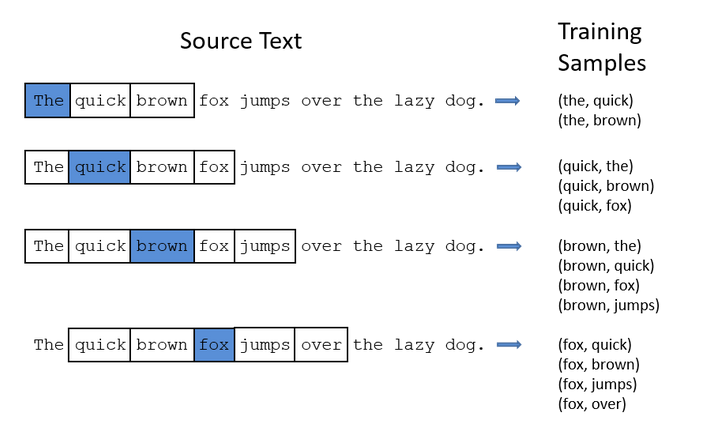
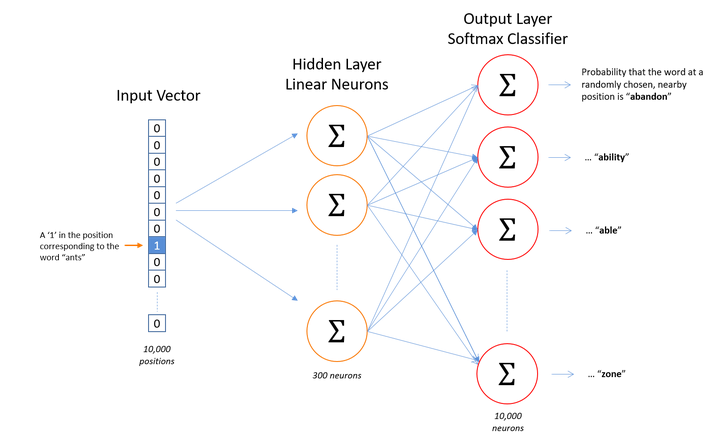
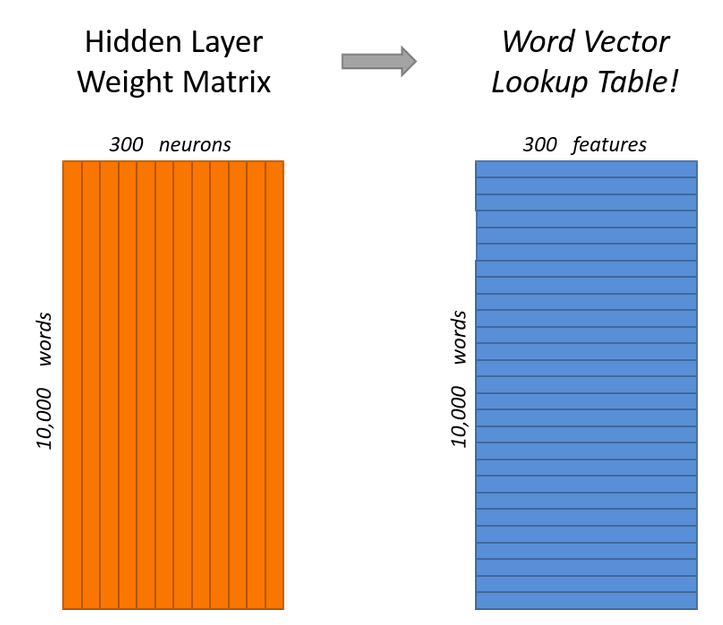
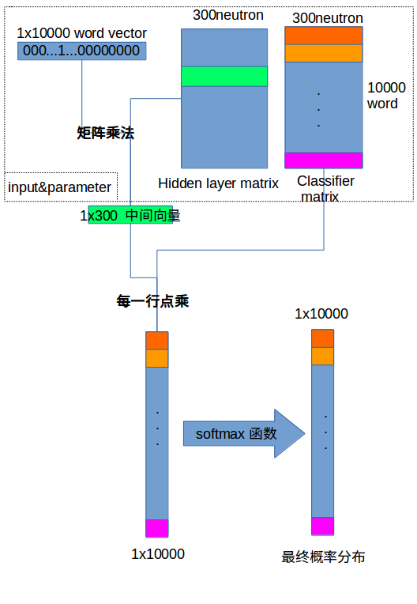
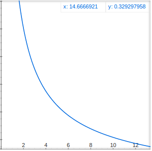

# word2vec 笔记

## 目标
将一段文本中的一个词转化为一个向量，对于不同的词可以通过其向量之间的点积标识其语义相近程度
## 主要基本步骤
* **读入一段文本，通过一段固定的“窗口”提取样本**

* **将每一个单词标识为一个one hot向量(例子为10000)，而设置一定的学习神经元（例子为300），对应建立分类器（与单词数目相同：10000）构成如下结构**

* **对于一个需要查询的单词，首先是使用其对应的one hot向量去乘以输入权重矩阵（从input vector到各个hidden layer neutron）得到中间向量**
&emsp;在例子里面：10000个单词，300个特征维度（中间神经元数目），则
&emsp;&emsp;input vector为  $w_i=[0,0,...,1,0,...,0]_{1\times 10000} $
&emsp;&emsp;weight maxtrix为  $W_{10000\times 300} $
&emsp;&emsp;产生的中间向量为  $[a_{i1},a_{i2},...,a_{i300}]_{1\times 300} $
**对于中间向量，再经过输出层的分类（矩阵运算后进行softmax），得到一个最终的概率分布向量**
&emsp;&emsp;输出层矩阵 $W'_{300\times 10000}$
&emsp;&emsp;产生的最终向量为  $1\times 10000 $ 的向量

上图划线表示了不同小逻辑单位（每个neutron或者softmax classifier）

## Problems and Solution
### 问题
1. 大样本下原有的梯度计算方法沉重（两个权重矩阵，均为$|v|\times|d|$大小，其中|v|为vocabulary大小,|d|为neutron number 也是feature dimension）
2. softmax非常沉重
### 思路
1. 常见词组合并为短语(phrase)
2. 在原本样本集合中再增加一层采样(subsampling)
3. Sample-based approach vs Softmax
&emsp;使用nagative sampling\NCE方法，只对少量权重进行反馈修整(nagative sampling)
### 合并词组
* 每次合并仅仅两个词，但是可以多次合并，使得合并后的phrase与新的词或者phrase合并成为更长的phrase
* 记录词的组合出现的次数，利用方程比较，将一起出现多于单独出现的词合并
* 优先将不经常出现的词组合并，避免常用句式（this is等）影响
### 再采样
1. 无意义组合删除，如('the'，'xxx')等
2. 采样率修正：对于不常出现的词，删去（具体操作时采用替换为特殊已知词组，再主动忽略）
单词保留概率

\[
z(w_i)=\frac{N_{word}}{N_{corpus}}
\]

\[
P(w_i)=(\sqrt{\frac{z(w_i)}{0.001}}+1)\frac{0.001}{z(w_i)}
\]

$y=\frac{sqrt(x)+1}{x}$

### negative sampling（Sample-based approach）
#### 作用
避免计算所有权重（全部更新：一次样本输入，需要更新10,000x300的权重）
#### 做法 
* 对于一个样本（A,B）,将A作为中心词输入，计算，理想输出应该是关于B的one hot vector，通常做法是全部softmax直接计算反馈更新
* nagative sampling:更新时，对于反馈更新：
&emsp;**1.** 更新classifier matrix的权重仅仅更新一个目标正确判断的classifier（B对应的classifier）（**positive sample**）和随机选取的若干个（如5个）错误判断（理想vector为0的位置）(**nagative sample**)的classifier的权重（更新6x300）
&emsp;**2.** 更新hidden layer matrix的权重，仅仅更新与输入向量（对应A）有关的权重（更新1x300）__（这一步与Nagative Sampling无关）__

#### nagative sample 的选取法则
选取概率
\[
P(w_i)=\frac{freq(w_i)^\frac{3}{4}}{\Sigma{freq(w)^\frac{3}{4}}}
\]
**$\frac{3}{4}$为magic number**
### NCE:Noise Contrastive Estimation（Sample-based approach）
#### 变量约定
| variable             | meaning                                             |
|:---------------------|:----------------------------------------------------|
| $\theta$             | parameter                                           |
| $w$                  | word                                                |
| $c$                  | context                                             |
| $s_\theta(w_i,c)$    | score                                               |
| $u_\theta(w_i,c)$    | $e^{s_\theta(w_i,c)}$                               |
| $Z(c)$               | $\Sigma_{w}(u_\theta,c)$                            |
| $\widetilde{p} (w_i\| c)$ or $\widetilde{p}(c)$ | empirical distributions |
| $q(w)$               | noise distribution                                  |

\[
p_\theta(w_i|c)=\frac{u_\theta(w_i,c)}{\Sigma_{w}(u_\theta,c)}
=\frac{u_\theta(w_i,c)}{Z_\theta(c)}
\]
## 参考资料
Chris McCormick：
[Word2Vec Tutorial - The Skip-Gram Model](http://mccormickml.com/2016/04/19/word2vec-tutorial-the-skip-gram-model/)
[Word2Vec Tutorial Part 2 - Negative Sampling](http://mccormickml.com/2017/01/11/word2vec-tutorial-part-2-negative-sampling/)
Chris Dyer :
[Notes on Noise Contrastive Estimation and Negative Sampling](https://arxiv.org/pdf/1410.8251.pdf)