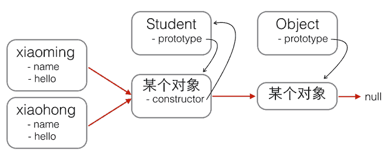
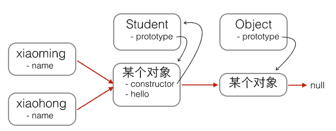
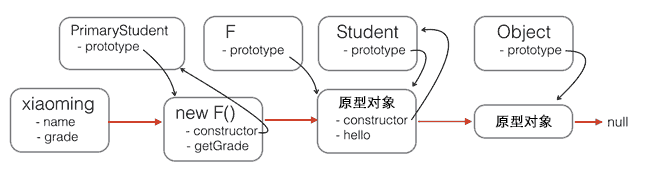

# 2018-2-2 JavaScript Note 5

## 面向对象
#### 构造
1. 直接用{ ... }创建一个对象
2. 构造函数(注意调用的new)

```JavaScript
function Student(name) {
    this.name = name;
    this.hello = function () {
        alert('Hello, ' + this.name + '!');
    }
}
var xiaoming = new Student('小明');
xiaoming.name; // '小明'
xiaoming.hello(); // Hello, 小明!
```
也可以

```JavaScript
function Student(name) {
    this.name = name;
}

Student.prototype.hello = function () {
    alert('Hello, ' + this.name + '!');
};

```
#### 原型继承
JavaScript的原型继承实现方式就是：
1. 定义新的构造函数，并在内部用call()调用希望“继承”的构造函数，并绑定this；
2. 借助中间函数F实现原型链继承，最好通过封装的inherits函数完成；
3. 继续在新的构造函数的原型上定义新方法。

```JavaScript
// PrimaryStudent构造函数:
function PrimaryStudent(props) {
    Student.call(this, props);
    this.grade = props.grade || 1;
}

// 空函数F:
function F() {
}

// 把F的原型指向Student.prototype:
F.prototype = Student.prototype;

// 把PrimaryStudent的原型指向一个新的F对象，F对象的原型正好指向Student.prototype:
PrimaryStudent.prototype = new F();

// 把PrimaryStudent原型的构造函数修复为PrimaryStudent:
PrimaryStudent.prototype.constructor = PrimaryStudent;

// 继续在PrimaryStudent原型（就是new F()对象）上定义方法：
PrimaryStudent.prototype.getGrade = function () {
    return this.grade;
};

// 创建xiaoming:
var xiaoming = new PrimaryStudent({
    name: '小明',
    grade: 2
});
xiaoming.name; // '小明'
xiaoming.grade; // 2

// 验证原型:
xiaoming.__proto__ === PrimaryStudent.prototype; // true
xiaoming.__proto__.__proto__ === Student.prototype; // true

// 验证继承关系:
xiaoming instanceof PrimaryStudent; // true
xiaoming instanceof Student; // true
```
**可以写一个inherit函数封装操作**
```JavaScript
function inherits(Child, Parent) {
    var F = function () {};
    F.prototype = Parent.prototype;
    Child.prototype = new F();
    Child.prototype.constructor = Child;
}
```
#### class继承
不再需要复杂操作
```JavaScript
class Student {
    constructor(name) {
        this.name = name;
    }
//注意没有function关键字
    hello() {
        alert('Hello, ' + this.name + '!');
    }
}
```
继承
```JavaScript
class PrimaryStudent extends Student {
    constructor(name, grade) {
        super(name); // 记得用super调用父类的构造方法!
        this.grade = grade;
    }

    myGrade() {
        alert('I am at grade ' + this.grade);
    }
}

```