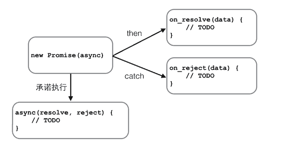

# 2018-2-6 JavaScript Note 7
## AJAX
>要让用户留在当前页面中，同时发出新的HTTP请求，就必须用JavaScript发送这个新请求，接收到数据后，再用JavaScript更新页面，这样一来，用户就感觉自己仍然停留在当前页面，但是数据却可以不断地更新。
>最早大规模使用AJAX的就是Gmail，Gmail的页面在首次加载后，剩下的所有数据都依赖于AJAX来更新。
>用JavaScript写一个完整的AJAX代码并不复杂，但是需要注意：AJAX请求是异步执行的，也就是说，要通过回调函数获得响应

在现代浏览器上写AJAX主要依靠XMLHttpRequest对象
```JavaScript
function success(text) {
    var textarea = document.getElementById('test-response-text');
    textarea.value = text;
}

function fail(code) {
    var textarea = document.getElementById('test-response-text');
    textarea.value = 'Error code: ' + code;
}
//高版本浏览器
var request = new XMLHttpRequest(); // 新建XMLHttpRequest对象
//低版本浏览器
//var request = new ActiveXObject('Microsoft.XMLHTTP'); // 新建Microsoft.XMLHTTP对象
request.onreadystatechange = function () { // 状态发生变化时，函数被回调
    if (request.readyState === 4) { // 成功完成
        // 判断响应结果:
        if (request.status === 200) {
            // 成功，通过responseText拿到响应的文本:
            return success(request.responseText);
        } else {
            // 失败，根据响应码判断失败原因:
            return fail(request.status);
        }
    } else {
        // HTTP请求还在继续...
    }
}

// 发送请求:
request.open(/*method*/'GET', /*url*/'/api/categories');
request.send(/*data*/);

alert('请求已发送，请等待响应...');

```
* 当创建了XMLHttpRequest对象后，要先设置onreadystatechange的回调函数。在回调函数中，通常我们只需通过readyState === 4判断请求是否完成，如果已完成，再根据status === 200判断是否是一个成功的响应。

* XMLHttpRequest对象的open()方法有3个参数，第一个参数指定是GET还是POST，第二个参数指定URL地址，第三个参数指定是否使用异步，默认是true，所以不用写。

* 注意，千万不要把第三个参数指定为false，否则浏览器将停止响应，直到AJAX请求完成。如果这个请求耗时10秒，那么10秒内你会发现浏览器处于“假死”状态。

* 最后调用send()方法才真正发送请求。GET请求不需要参数，POST请求需要把body部分以字符串或者FormData对象传进去。
* 上面代码的URL使用的是 **相对路径** 。如果你把它改为```http://www.sina.com.cn/```，再运行，肯定报错。在Chrome的控制台里，还可以看到错误信息。这是因为浏览器的同源策略导致的。**默认情况下，JavaScript在发送AJAX请求时，URL的域名必须和当前页面完全一致**。完全一致的意思是，域名要相同（www.example.com和example.com不同），协议要相同（http和https不同），端口号要相同（默认是:80端口，它和:8080就不同）。有的浏览器口子松一点，允许端口不同，大多数浏览器都会严格遵守这个限制。

那是不是用JavaScript无法请求外域（就是其他网站）的URL了呢？方法还是有的，大概有这么几种：

一是通过Flash插件发送HTTP请求，这种方式可以绕过浏览器的安全限制，但必须安装Flash，并且跟Flash交互。不过Flash用起来麻烦，而且现在用得也越来越少了。

二是通过在同源域名下架设一个代理服务器来转发，JavaScript负责把请求发送到代理服务器：

'/proxy?url=http://www.sina.com.cn'

代理服务器再把结果返回，这样就遵守了浏览器的同源策略。这种方式麻烦之处在于需要服务器端额外做开发。

第三种方式称为JSONP，它有个限制，只能用GET请求，并且要求返回JavaScript。这种方式跨域实际上是利用了浏览器允许跨域引用JavaScript资源：
```JSONP
<html>
<head>
    <script src="http://example.com/abc.js"></script>
    ...
</head>
<body>
...
</body>
</html>
```
这样一来，我们如果在页面中先准备好foo()函数，然后给页面动态加一个<script>节点，相当于动态读取外域的JavaScript资源，最后就等着接收回调了
* 首先在页面中准备好回调函数
```JavaScript
function refreshPrice(data) {
    var p = document.getElementById('test-jsonp');
    p.innerHTML = '当前价格：' +
        data['0000001'].name +': ' + 
        data['0000001'].price + '；' +
        data['1399001'].name + ': ' +
        data['1399001'].price;
}
```
* 接下来调用
```JavaScript
function getPrice() {
    var
        js = document.createElement('script'),
        head = document.getElementsByTagName('head')[0];
    js.src = 'http://api.money.126.net/data/feed/0000001,1399001?callback=refreshPrice';
    head.appendChild(js);
}
```
则会访问http://api.money.126.net/data/feed/0000001,1399001，将返回的数据以refreshPrice（prop)执行
### 延时异步执行
```JavaScript
setTimeout(var_function,var_time_msec,var_para_of_var_function)
```
### Promise对象
```JavaScript
//等效于上面的AJAX直接修改
var ajax = ajaxGet('http://...');
ajax.ifSuccess(success)
    .ifFail(fail);
```
可以用Promise实现
```JavaScript
function test(resolve,reject){
  ...
  if(...){
    resolve("success message");
  }else{
    reject("reject message");
  }
}
var p=new Promise(test).then(function(msg){;}).catch(function(msg){;});
```

要串行执行这样的异步任务，不用Promise需要写一层一层的嵌套代码。有了Promise，我们只需要简单地写：
```JavaScript
job1.then(job2).then(job3).catch(handleError);
```
#### 其他
1. 并行
Promise.all([p1,p2]).then(...)
2. 同时进行只需要一个完成
Promise.race([p1,p2]).then(...)