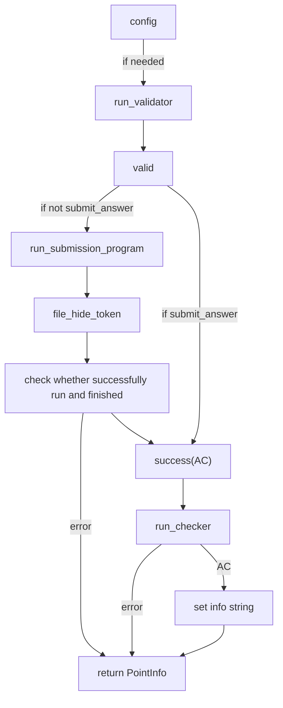
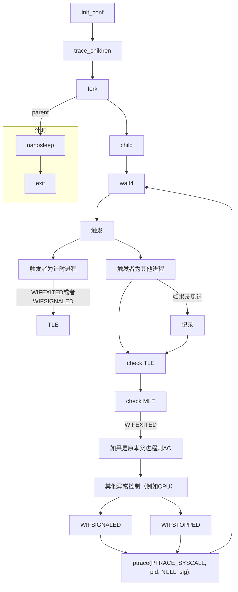

# UOJ阶段总结(2) 评测调库流程概览
## 1. 校验器val.cpp
对于输入的校验控制，保证输入合法
* 使用testlib.h
* 在```registerValidation()```之后获得了流inf，通过流的以下函数调用检验
或者调用```ensuref()```：
```cpp
ensuref(cmd=='Q' || cmd=='A' || cmd=='C' , "您输入的操作不合法");
```
| 函数                                         | 功能                                                                             |
|:---------------------------------------------|:---------------------------------------------------------------------------------|
| void registerValidation()                    | 初始化，应该在程序开始时调用                                                     |
| char readChar()                              | 读取一个字符                                                                   | |
| char readChar(char ch)                       | 读取一个字符，必须是指定的ch                                            |        |
| char readSpace()                             | 读取一个空格                                                                  |  |
| void unreadChar(char ch)                     | 将ch添加到输入流的最后面                                              |          |
| string readToken()                           | 读取一个字符串，相当于scanf中的%s                                           |    |
| string readToken(string regex)               | 读取一个字符串，必须满足给定的表达式regex，表达式语法类似于正则 |                |
| string readWord() 	同readToken()              |                                                                                  |
| string readWord(string regex)                | 同readToken(string regex)                                        |               |
| long long readLong()                         | 读取一个long long变量                                                     |      |
| long long readLong(long long L, long long R) | 读取一个long long变量，必须在[L,R]以内            |                              |
| long long readLong(long long L, long long R) | 读取一个long long变量，必须在[L,R]以内            |                              |
| long long readLong(long long L, long long R) | 读取一个long long变量，必须在[L,R]以内            |                              |
| int readInt()或readInteger()                 | 读取一个int变量                                                   |              |
| int readInt(int L, int R)                    | 读取一个int变量，必须在[L,R]以内                                     |           |
| double readDouble()或readReal()              | 读取一个double类型变量                                         |                 |
| double readDouble(double L, double R)        | 读取一个double类型变量，必须在[L,R]以内                  |                       |
| string readLine()或readString()              | 读取一整行，相当于gets()                                       |                 |
| string readLine(string regex)                | 读取一整行，必须满足给定的表达式regex                            |               |
| void readEoln()                              | 读取一个换行符               |                                                   |
| void readEof()                               | 读取文件结束符                                                                   |

## 2.答案校验器chk.cpp


>自定义校验器时注意在problem.conf中去掉use_builtin_checker那一行

1. 开始
```cpp
registerTestlibCmd(argc, argv);
```
从而获得三个流
* ```inf```： 输入数据
* ```ouf``` ： 选手输出
* ```ans``` ： 标准输出
2. 接下来从流中获取数据
函数同校验器，例如
```cpp
int pans,jans;
pans=ouf.readInt();      // 读取选手输出
jans=ans.readInt();      // 读取答案
```
3. 返回结果
```cpp
quitf(_ok, "Correct.");
quitf(_wa, "WA! expect=%d recieve=%d", jans, pans);
```

## 3.main_judger
* uoj_judger.h
* uoj_env.h

* 这里怎么说好呢，很多跨文件的数据结构被做成全局的，然后被统一init，个人觉得如果封装一下会更好
* 这个的主要是对于参数进行了一下统筹，最后还是根据配置去```sys(...)```运行内置的```judger```，或者自己写的judger(__需要写好Makefile和judger.cpp，编译出```judger```__)
### 1) main_judger_init(argc,argv)
初始化
| Oper                 | 说明                                 |
|:---------------------|:-------------------------------------|
| main_path=...        |                                      |
| work_path=...        |                                      |
| result_path=...      |                                      |
| data_path=...        |                                      |
| problem_id=...       |                                      |
| config["judger"]=... | 这里配置评测机是单独另写的还是专用的 |

* load_config:
submission.conf
problem.conf
### 2)run_program(...)
这里就是统筹各种参数了，最后sys(...)

## 4.judger
* 内置的根据参数判断怎么评测
### 1）ordinary_test（一般用的是这个）
```mermaid
graph TD
  A[获取数据]-->A1[n_tests]
  A[获取数据]-->A2[n_ex_tests]
  A[获取数据]-->A3[n_subtasks]
  subgraph compile
    B0[report]-->B
    B[compile with\without implementer]-->B1[report]
    B[compile with\without implementer]-->B2[error]
  end
  A1-->B0
  A2-->B0
  A3-->B0
  subgraph subTask=0
    C0[report]-->C["test_point(i)"]
    C-->C1[add_point_info]
    C1--loop-->C
    C1-->C2[report]
  end
  subgraph subTask>0
    D0[report]-->D["blabla"]
    D-->D2[report]
  end
  B1--subTask=0-->C0
  B1--subTask=0-->D0
  C2-->E[end_judge_ok]
  D2-->E
```
#### compile
* 根据配置判断是什么语言，然后配置参数运行vrun_program再运行
* 出错信息：一方面是函数的直接返回结构体，一方面存在日志compiler_result.txt中
* 编译方法

| 类型   | 方法       | 其他 |
|:-------|:-----------|:-----|
| C++    | g++        |      |
| Python | py_compile |      |
| c      | gcc        |      |
#### test_point

* run_submission_program也是调用run_program，但是先对语言类型分了类加了一些参数
### 2)  run_program
#### 1. 先parse_args配置run_program_config结构体
例如：
* 时间空间限制
* 使用的运行前置参数（例如/usr/bin/python2.7 -E -s -B）
#### 2. fork
##### 1）父进程（实际的测试进程）
(1)利用之前的run_program_config结构体和其他参数对操作系统交互配置具体环境
例如：
* USER
* PATH
* PWD
* LOGNAME
* HOME
* LANG
* SHELL

(2)启动ptrace
(3)execv
##### 2）子进程

## 完全凭印象的总结
运行部分通过fork出进程搞检测
返回结果方面通过读log
## 其他
不想写了，之后写吧
_2018/04/23_