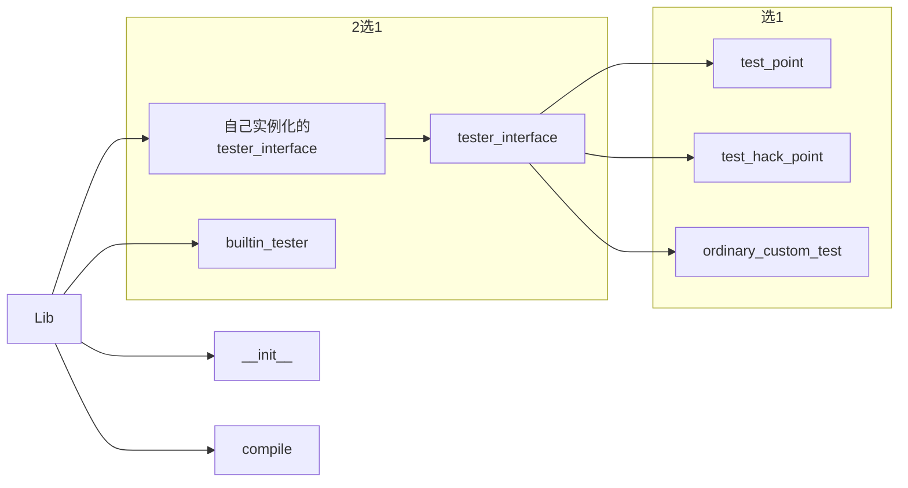
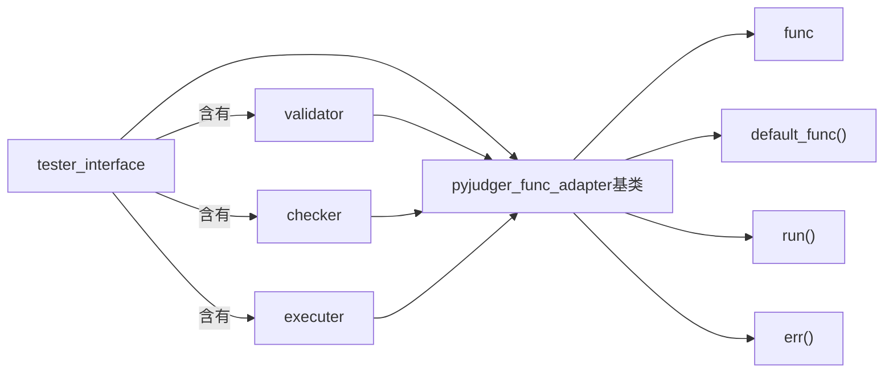

# pyjudger阶段设计
## 一、部分结构


## 二、类设计
### interface标识测试一个subtask或者一个测试点
```mermaid
graph LR
整个lib的self.config--传给-->tester_interface
tester_interface-->A1["func句柄"]
tester_interface-->B1["default_func()"]
subgraph 二选1
A1--或者-->B1
A1--或者-->C1[构造时外部指定]
end
tester_interface-->A2["err句柄"]
tester_interface-->B2["default_err()"]
subgraph 二选1
A2--或者-->B2
A2--或者-->C2[构造时外部指定]
end

tester_interface-->A3["succ句柄"]
tester_interface-->B3["default_succ()"]
subgraph 二选1
A3--或者-->B3
A3--或者-->C3[构造时外部指定]
end

tester_interface-->B4["其他后续tester_interface:作subtask"]

tester_interface-->B5["run()"]

subgraph 
B5-->执行句柄
end
```
### 考虑到其他需要的部分

### 代码仍在编写中
## 三、上周其他任务
php网页端修改了代码，使得能够进行群组信息预览

__2018-5-29姚振翮__


```python 
def subtask_func():
    t=pyjudger_Tester(config)
    for i in range(10):
       t.test(i)
subTask=pyjudger_Tester(func=subtask_func)
```

```python 
  t=pyjudger_Tester(config)
  for i in range(10):
      t=pyjudger_Tester(config,succ=t.run)
```