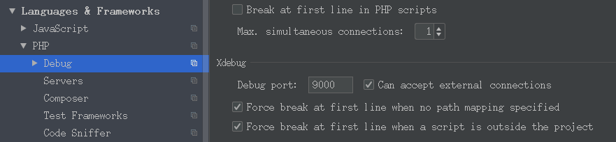
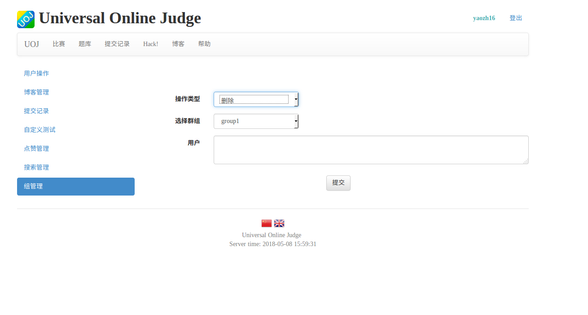
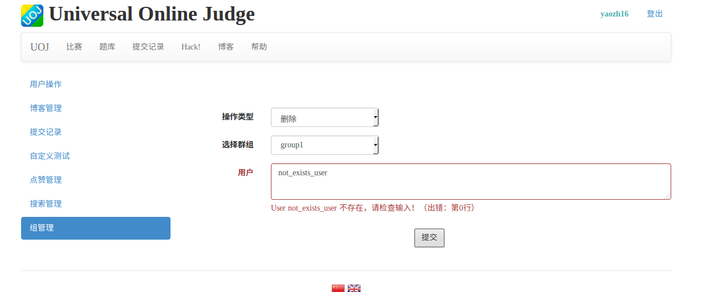

# UOJ再开发：第一阶段工作报告
## 〇、目录
* [一、UOJ工作流程整理](#一-uoj工作流程整理)
&emsp; [1.judge client工作流程图](#1judge-client工作流程图)
&emsp; [2.main_judger与judger概述](#2main_judger与judger概述)
&emsp; [3.judger工作流程逻辑](#3judger工作流程逻辑)
&emsp; [4.test_point校验答案工作逻辑](#4test_point校验答案工作逻辑)
* [二、UOJ使用及开发所涉及到的工具与库](#二-uoj使用及开发所涉及到的工具与库)
&emsp; [1. chk.cpp/val.cpp等的编写](#1chkcppvalcpp等的编写)
&emsp; [2. docker](#2docker)
&emsp; [3. svn](#3svn)
&emsp; [4. mysql](#4-mysql)
* [三、UOJ评测实践](#三-uoj评测实践)
&emsp; [0.文件系统](#0文件系统)
&emsp; [1.简单 A+B problem](#1简单-ab-problem)
&emsp; [2.教小明实现A+B problem](#2教小明实现-ab-problem)
* [四、继续开发评测机](#四-继续开发评测机)
&emsp;[接下来可以做的方向](#接下来可以做的方向)
* [五、其他工作](#五-其他工作)
&emsp;[1. uoj网页端开发：xdebug配置与使用](#1uoj网页端开发xdebug配置与使用)
&emsp;[2. UOJ群组管理(sql设计、js代码、php代码已完成)](#2-uoj群组管理)
&emsp;&emsp;&emsp;已经完成管理员校验同意入组、授权、建组、增删人员、查询等功能
&emsp;&emsp;&emsp;已经完成用户查询功能，暂时未写报名，大概还需要一到两天完成
&emsp;&emsp;&emsp;[点击这里](#6效果预览)看管理界面


## 一、UOJ工作流程整理
### 1.judge client工作流程图

### 2.main_judger与judger概述
* 功能

| 可执行文件  | 功能说明 | 其他说明                  |
|:------------|:---------|:--------------------------|
| main_judger | 统筹参数 | 通过run_program调用judger |
| judger      | 实际评测 | 包括编译、测试等          |

* 为了安全性考虑，main_judger与judger均通过run_program等uoj库函数进行进程调用
### 3.judger工作流程逻辑
* 在svn同步(文件系统见后面)之后，我们自己写的```judger.cpp```与```uoj_judger.h```还有其他输入输出文件、val.cpp、chk.cpp、problem.conf等传到相应目录。在配置下，其中judger.cpp、val.cpp、chk.cpp等在我们在网页端发送指令后开始编译，生成judger、val、checker等可执行文件
* 每次有一提交（假设为zip提交），则服务器将选手提交的zip文件解压到```/home/local_main_judger/work```路径下（当然路径内先进行清理过了）
* 然后在```/var/svn/problem/[problem_id]/cur/[problem_id]/1```路径下运行我们之前编译的judger：
```mermaid
graph TD
  A[获取数据]-->A1[n_tests]
  A[获取数据]-->A2[n_ex_tests]
  A[获取数据]-->A3[n_subtasks]
  subgraph compile
    B0[report]-->B
    B[compile with\without implementer]-->B1[report]
    B[compile with\without implementer]-->B2[error]
  end
  A1-->B0
  A2-->B0
  A3-->B0
  subgraph subTask=0
    C0[report]-->C["test_point(i)"]
    C-->C1[add_point_info]
    C1--loop-->C
    C1-->C2[report]
  end
  subgraph subTask>0
    D0[report]-->D["blabla"]
    D-->D2[report]
  end
  B1--subTask=0-->C0
  B1--subTask=0-->D0
  C2-->E[end_judge_ok]
  D2-->E
```
### 4.test_point校验答案工作逻辑

## 二、UOJ使用及开发所涉及到的工具与库
### 1.chk.cpp/val.cpp等的编写
* 主要都是使用```testlib.h```
* 使用前初始化、使用时注意采用testlib的流
* 示例

_chk.cpp ： 校验选手输出结果是否正确的_
```cpp
#include "testlib.h"
int main(int argc, char* argv[]){
    registerTestlibCmd(argc, argv);
    int pans,jans;
    pans=ouf.readInt();      
    jans=ans.readInt();    
    if (pans == jans)
        quitf(_ok, "Correct.");
    else
        quitf(_wa , "WA! expect=%d recieve=%d", jans, pans);
}
```
_val.cpp ：对hack模式下某个输入先进行格式验证与数据合理性验证_
```cpp

#include "testlib.h"
int main(void){
    registerValidation();

    inf.readInt(0,1000000000,"A");
    inf.readSpace();
    inf.readInt(0,1000000000,"B");
    inf.readEoln();

    inf.readEof();
    return 0;
}
```

### 2.docker
* 类似虚拟机，可以非常方便地创建系统镜像并装载，对于像我这种装东西之后容易忘记卸而导致环境越来越脏的家伙来说还是很方便的。
* docker的镜像一般自动在dockerhub上的源下载，有点类似git
* docker的image是静态的，如果运行需要创建容器并装载
* container被干掉对image没有影响，但是装载时就仍然是image的状态了，这点和git也是相同的
* 一些常用基本命令
start container
attach container
rename container
commit container
tag image
run image
* docker run 目前接触到的参数

| 参数                                    | 说明                                                                                                                                        |
|:----------------------------------------|:--------------------------------------------------------------------------------------------------------------------------------------------|
| -p [port1]:[port2]  [port3]:[port4] ... | 对端口的映射                                                                                                                                |
| --add-cap [配置]                        | 添加配置（这一点很坑，一开始就没给SYS_PTRACE权限导致gdb无法运行然后一直ce：因为评测机在test_point阶段的评测是利用了fork并且设置了进程监控） |
| --name=[name]                           | 设置名字                                                                                                                                    |
| -it                                     | 等价与马上attach新产生的容器                                                                                                                |
* uoj系统装载在docker中，由于安装的ubuntu为精简版，所以很多依赖都需要自己安装

### 3.svn
* 和git不太一样，中心式的，每次ci都是传给服务器
* svn只是在第一次co的时候需要认证，之后根据uuid可以省去认证
* 服务器端权限配置
1. 在项目目录的“conf/”目录下面有.conf文件,记录对于不同类型用户的主要权限、密码数据库和authez数据库（其实就是文本文件）的路径
权限主要就是none、read、write
```
anon-access = none
auth-access = write
password-db = passwd
```
2. 数据库

1)密码数据库就是 user=passwd 的格式:
```
[users]
our-root = abc
userA = 666
```
2)authez数据库是对权限的细分:
```
[aliases]
# joe = /C=XZ/ST=Dessert/L=Snake City/O=Snake Oil, Ltd./OU=Research Institute/CN=Joe Average
# 分组信息
[groups]
harry_and_sally = harry,sally
harry_sally_and_joe = harry,sally,&joe

#/foo/bar 目录：harry可以读写，joe可以读, 其他人不给权限
[/foo/bar]
harry = rw
&joe = r
* =
#/baz/fuz 目录：harry_and_sally可以读写，其他人只能读
[repository:/baz/fuz]
@harry_and_sally = rw
* = r
```
* 客户端常用命令
svn co [svn_path]
svn add [file_path]
svn commit
svn ci 
svn up
* uoj项目中主要有三个svn目录，在```/var/svn```目录下 
1. uoj
2. problem
3. judge_client

比如如果要复制uoj目录进行网页端修改，可以先修改这个目录的svn的passwd后在shell中
```
svn co svn:\\[docker_ip_address]\var\uoj --username yaozh16
```
### 4. mysql
* uoj上密码为root
* 启动
```
mysql -u root -p
```
* 常用命令

| 说明                 | 命令                                     |
|:---------------------|:-----------------------------------------|
| 显示所有数据库       | show databases;                          |
| 显示当前数据库所有表 | show tables;                             |
| 装载数据库           | use [databaseName];                      |
| 显示数据表的结构     | describe [tableName];                    |
| 建库                 | create database [databaseName];          |
| 建表                 | create table [tableName] (字段设定列表); |
| 删库                 | drop database [databaseName];            |
| 删表                 | drop table [tableName]；                 |
| 将表中记录清空       | delete from [tableName];                 |
| 显示表中的记录       | select * from [table]                    |

建表例子(例子来自菜鸟教程)
```sql
CREATE TABLE IF NOT EXISTS `runoob_tbl`(
   `runoob_id` INT UNSIGNED AUTO_INCREMENT,
   `runoob_title` VARCHAR(100) NOT NULL,
   `runoob_author` VARCHAR(40) NOT NULL,
   `submission_date` DATE,
   PRIMARY KEY ( `runoob_id` )
)ENGINE=InnoDB DEFAULT CHARSET=utf8;
```

## 三、UOJ评测实践
### 0.文件系统
svn co一个problem后（假设id是k），需要建立如下文件系统
```
k(directory)
|-1(directory)
  |-chk.cpp
  |-problem.conf
  |-val.cpp
  |-judger.cpp
  |-testlib.h
  |-uoj_judger.h
  |-in_1.insuffix(text file)
  |-in_2.insuffix(text file)
  |-out_2.outsuffix(text file)
  |-out_2.outsuffix(text file)
  |-download(directory)
     |-提供给同学下载的文件都在这里，会被打包成problemk.zip
```
经过编译之后，会增加
```
|-1(directory)
  |-checker(executable)
  |-validator(executable)
  |-judger(executable)
```
### 1.简单 A+B problem
#### (1) problem.conf
```
use_builtin_judger on
use_builtin_checker ncmp
n_tests 10
n_ex_tests 0
n_sample_tests 0
input_pre www
input_suf in
output_pre www
output_suf out
time_limit 1
memory_limit 256
output_limit 64
```
然后写好每个对应的```www[k].in``` ```www[k].out```等就可以了，连```judger```都不需要自己写（只要同学的代码是通过文本编辑框输入提交的——这时候编译过程总内建的judger只会处理文本编辑框返回的.code文件）
### 2.教小明实现 A+B problem
稍稍麻烦一点点
>目标:助教写main文件，且每次使用不同的main.cpp与选手的同一个input.h编译与评测

#### (0)主要思路

* 这个题目需要每一次评测的时候都将相应的主函数入口切换，也就是每次都要用不同的main.cpp。
* 在原本默认main_judger的基础上，我们需要修改我们的judger为：

| 原本                           | 修改后                                               |
|:-------------------------------|:-----------------------------------------------------|
| 先编译，后对不同组数据进行测试 | 每一组测试前，移动相应的main.cpp，编译、测试一组数据 |
更多详细内容可以看下面
#### (1)文件系统
chk.cpp其实可以不用写，只要内建也行，这里演示所以使用自己的chk.cpp。

#### (2)problem.conf
配置

#### (3)judger.cpp
可以看下面注释
```cpp
#include "uoj_judger.h"
#include <sstream>
using namespace std;
void ordinary_test() {
	int n = conf_int("n_tests", 5);//读取的参数，现在从词典中取出
    for (int i = 1; i <= n; i++) {//开始每一轮测试
        string& path=work_path;
        ostringstream os; //构造一个输出字符串流
        // 主要是上层编译judger的时候没有用c++11选项所以用to_string会编译出错
        os<<"main"<<i;
        string name=os.str();//编译生成可执行文件名字
        os<<".cpp";
        string main_file=os.str();//需要移动的main文件名
        //运行时，judger在/var/uoj/i(问题编号)目录
        //此时 name为main1，main2等形式
        //此时 main_file为main1.cpp，main2.cpp等形式
        system(("cp "+main_file+ " "+path+"/"+main_file).c_str());//复制相对应的文件到工作目录

        report_judge_status_f("Compiling Test #%d", i);//通知消息到选手的网页端，会提示正在编译
        
        //编译，结果存在c_ret中
        //run_compiler也起到了参数控制作用，本身还是调用run_program
        RunCompilerResult c_ret =  
        run_compiler(path.c_str(),
                    "/usr/bin/g++-4.8", 
                    "-o", 
                    name.c_str(), 
                    main_file.c_str(), 
                    "-x", 
                    "c++",  
                    "-lm", 
                    "-O2", 
                    "-DONLINE_JUDGE", 
                    NULL);
        if (!c_ret.succeeded) {//编译没有成功
            //告知选手编译出错
            report_judge_status_f("Compile Test #%d Failed", i);
            //创建一个测试点信息，出错性质为comile error，result一栏中输出b编译具体出错信息
            PointInfo po=PointInfo(i,0,0,-1,"compile error","","",c_ret.info);
            add_point_info(po);//等待之后一起传回网页端
        }else {
          //报告正在测试
            report_judge_status_f("Judging Test #%d", i);
            //测试该点，使用的配置是在uoj_judger.h中读取
            //返回信息为一个测试点
            PointInfo po = test_point(name.c_str(), i);
            //该点的得分按比例转化为一定的总得分中的占比
            //第二个参数是该点得满分的时候应该使总分增加多少
            po.scr = scale_score(po.scr, conf_int("point_score", i, 100 / n));
            add_point_info(po);//等待之后一起传回网页端
        }
    }

	end_judge_ok();//结束测试，把各个PointInfo传回
}

int main(int argc, char **argv) {
	judger_init(argc, argv);//uoj_judger.h中，读取参数配置，并进行各种参数的初始化
	ordinary_test();
}
```
#### (4)chk.cpp
这里本来用builtin_checker就可以了，但是下面做个示范
testlib.h中初始化了流，我们需要调用这些流获取数据

#### (5)main.cpp
这个本来没什么写的，但是演示一下也可以
```cpp
//main1.cpp测试加法
#include "input.h"
#include <iostream>
int main(){
  Input in;
  std::cout<<in.x+in.y;
}
```

```cpp
//main2.cpp测试乘法
#include "input.h"
#include <iostream>
int main(){
  Input in;
  std::cout<<in.x*in.y;
}
```
```cpp
//main3.cpp测试减法
#include "input.h"
#include <iostream>
int main(){
  Input in;
  std::cout<<in.x-in.y;
}
```
#### (6)其他
输入输出的数据是自己静态写的，但是根据UOJ judger的工作特性，可以临时生成
例如可以编写好标准的程序，然后编译为可执行文件（不妨叫他std_program吧）
然后在judger.cpp的编译操作那一步，可以这样写（假设include了相关的标准库头文件,并且给下面变量已经赋值好了）
```cpp
//临时生成input，防止选手静态if else方法过测试 
system((string("echo")+to_string(rand())+" "+to_string(rand())+">"+input_file).c_str());
//对临时生成的input文件，使用标准程序，生成对应的输出文件
system((std_program_path+" <"+input_file+" >"+output_file).c_str());
```
#### (7)操作

## 四、继续开发评测机
### 接下来可以做的方向
1. ```important```python对run_program做封装（生成一个python module）
2. ```important```python对uoj_judger做封装，写成一个class好一点
3. ```not important```修改php网页端表单让配置更加清晰简单
## 五、其他工作
&emsp;[1. uoj网页端开发：xdebug配置与使用](#1uoj网页端开发xdebug配置与使用)
&emsp;[2. UOJ群组管理(sql设计、js代码、php代码已完成)](#2-群组管理)
&emsp;&emsp;&emsp;已经完成管理员校验同意入组、群组授权、建组、增删人员、查询等功能
&emsp;&emsp;&emsp;已经完成用户查询功能，暂时未写主动报名，大概还需要一到两天完成
&emsp;&emsp;&emsp;[点击这里](#6效果预览)看管理界面
### 1.uoj网页端开发：xdebug配置与使用
* 服务器端：
1. 下载xdebug，编译安装```make & make install```
2. 修改```php.ini```添加配置
```
zend_extension= /usr/lib/php5/20121212/xdebug.so  #xdebug.so路径
xdebug.profiler_enable=on      
xdebug.trace_output_dir="/home/yaozh16/xdebug_trace"  #trace路径
xdebug.profiler_output_dir="/home/yaozh16/xdebug_profiler" #配置路径
xdebug.remote_enable=1 # 允许远程调试
xdebug.remote_handler=dbgp
xdebug.remote_mode=req
xdebug.remote_host=172.18.0.1  #调试客户端的ip的地址
xdebug.remote_port=9000        # 调试客户端的端口
xdebug.idekey="PHPSTORM"       #调试客户端key
```
3. 重启apache
* 客户端phpstorm配置
1. svn co方法获取uoj仓库，phpstorm装载项目
2. 打开phpstorms设置，按照之前在服务器上php.ini上设置的端口选择

3. 在server，创建server，配置host,debugger,mapping。这是为了之后调试的时候顺利在文件的指定位置暂停等

4. 编辑或者创建项目的debug configuration,选择web page（或者web application）选好我们刚才创建的server

### 2. UOJ群组管理
#### 2-1 UOJForm类
```php
function addTextArea(
      $name, 
      $label_text, //其中的标签的名字
      $default_value, 
      //function($str, &$vdata),
      //返回值为非空字符串时标识出错，
      //返回为''则继续执行$form->handle
      //其中可以修改$vdata的某个字域，这样可以之后handle调用的时候获得这部分信息
      $validator_php, 
      $validator_js)
//另外还要指定$form的handle
$form->handle = function(&$vdata){
  //通过验证，执行操作
}
```
当点了提交之后
#### 2-2 newAddDelCmdForm类是UOJForm的子类
```php
function newAddDelCmdForm($form_name, $validate, $handle, $final = null) 
//其中
$handle($cmd['type'], $cmd['obj'])//操作 +/-，obj是字段（如人名）
```
在mysql中的problems_permissions表中增加或者删掉表项

|problem_id|username|
|-|-|

最后同一更新密码svnRefreshPasswordOfProblem()
#### 2-3 如果要修改为增加一个按照group操作的开关
1. mysql添加一个group_info表与group_description表

| group_name | username  | is_admin | state   |
|:-----------|:----------|:---------|:--------|
| class1     | TA        | yes      | in      |
| class1     | student_X | no       | in      |
| class2     | student_X | no       | waiting |

| group_id | group_name | group_type |
|:---------|:-----------|:-----------|
| 1        | TA         | public     |

| group_type | 说明                           |
|:-----------|:-------------------------------|
| public     | 自由加入                       |
| protected  | 申请需要群组管理员认证加入     |
| private    | 不允许加入(只能管理员手动加入) |

| is_admin | 说明           |
|:---------|:---------------|
| yes      | 是群组管理员   |
| no       | 不是群组管理员 |


| state   | 说明                        |
|:--------|:----------------------------|
| in      | 在群组中                    |
| waiting | 仅在protected使用，等待认证 |

sql建表语句如下
```sql
use app_uoj233;
CREATE TABLE IF NOT EXISTS `group_description`(
   `group_id` INT UNSIGNED AUTO_INCREMENT,
   `group_name` VARCHAR(100) NOT NULL,
   `group_type` VARCHAR(40) NOT NULL,
   `other_config` VARCHAR(100) NOT NULL,
   PRIMARY KEY ( `group_id` )
)ENGINE=InnoDB DEFAULT CHARSET=utf8;
CREATE TABLE IF NOT EXISTS `group_info`(
   `group_name` VARCHAR(100) NOT NULL,
   `username` VARCHAR(40) NOT NULL,
   `is_admin` VARCHAR(5) NOT NULL,
   `state` VARCHAR(10) NOT NULL,
   `other_config` VARCHAR(100) NOT NULL
)ENGINE=InnoDB DEFAULT CHARSET=utf8;
```
2. 在网页的问题管理这边同样添加一个form
```php
//这个最好放在/app/uoj-validate-lib.php
function validateGroupname($group_name) {
	return is_string($group_name) ;
}
//这个放在/app/uoj-query-lib.php
//查询返回所有在群组中的人
function queryGroup($group_name) {
	if (!validateGroupname($group_name)) {
		return null;
	}
	return DB::selectAll("select * from group_info where group_name='{$group_name}' and state='in'", MYSQL_ASSOC);
}

//这个放在/app/controllers/problem_managers_manage.php
$managers_group_form = newAddDelCmdForm('managers_group',
    //$validate
    function($group_name) {
			if (!validateGroupname($group_name) || !queryGroup($group_name)) {
				return "不存在名为{$group_name}的组";
			}
			return '';
		},
    //handle
		function($type, $group_name) {
			global $problem;
			if ($type == '+') {
				foreach (queryGroup($group_name) as $key => $username) {
					mysql_query("insert into problems_permissions (problem_id, username) values (${problem['id']}, '$username')");
				}
			} else if ($type == '-') {
        foreach (queryGroup($group_name) as $key => $username) {
                mysql_query("delete from problems_permissions where problem_id = ${problem['id']} and username = '{$username}'");
            }
			}
		},
    //final
		function() {
			global $problem;
			svnRefreshPasswordOfProblem($problem['id']);
		}
	);
	//启动
	$managers_group_form->runAtServer();
  
  
//注意在/app/controllers/problem_managers_manage.php底下合适的位置需要加一句
managers_group_form->printHTML();
```


<div align="center">
效果图
</div>

#### 2-4 管理员批量设置group
##### 0.设计
1. 表单元件

| 元件              | 类型     | 内容                        | 应用               |
|:------------------|:---------|:----------------------------|:-------------------|
| group_operation   | select   | add/del/query/modify/create | 全部               |
| group_select      | select   | 已有的群组                  | 查询群组、增删人员 |
| group_is_admin    | select   | 权限                        | 增改人员           |
| group_query_state | select   | 根据in或者waiting等状态筛选 | 查询群组           |
| group_type        | select   |                             | 创建群组           |
| group_name        | input    |                             | 创建群组           |
| username          | textarea |                             | 查询群组、增删人员 |
2. 功能
* 创建群组

| 元件            | 作用 |
|:----------------|:-----|
| group_operation | in   |
| group_name      | in   |
| group_type      | in   |

* 查询群组

| 元件              | 作用 |
|:------------------|:-----|
| group_operation   | in   |
| group_select      | in   |
| group_query_state | in   |
| username          | out  |

* 群组增改人员

| 元件            | 作用 |
|:----------------|:-----|
| group_operation | in   |
| group_select    | in   |
| group_is_admin  | in   |
| username        | in   |

在增加人员前会删除原有的同一群组、同一人的其他条目，所以始终保证只有一条
* 群组删除人员

| 元件            | 作用 |
|:----------------|:-----|
| group_operation | in   |
| group_select    | in   |
| username        | in   |

##### 1.准备工作
我们准备将设置页面设在左边的组管理

本来还要创建一个php，但是既然本身super-都在一起，我们就不破坏代码整齐了，也就在```/super_manage.php```里面写新代码

##### 2. 创建边栏

##### 3.留下页面空间
```php
<?php elseif ($cur_tab === 'group'): ?>
```
如图

##### 4. 添加页面内容
现在页面是空白的，我们需要创建表单
由于出于安全考虑，我们的增删操作表单必须是post加密提交，但是直接使用原有的UOJFORM则有问题会导致直接die()掉而无法保存```$_POST```的数据，下一次返回的结果又需要信息，所以这里采用的方法是使用一个1s的cookie，从而实现查询
```php
$group_form =new UOJForm("group_form");
//查询结果处理
$query_group="";//cookie中上次查询的组
$query_user="";//cookie中上次查询的组的memeber的信息
$query_group_state="all";
$group_form_error_msg="";
if(isset($_GET)) {
    if (isset($_GET['group_query'])) {
        $query_group = $_GET['group_query'];
        $query_group_state = $_GET['group_query_state'];
        if($query_group_state=="all")
            $result= DB::selectAll("select * from group_info where group_name='{$query_group}'");
        else
            $result= DB::selectAll("select * from group_info where group_name='{$query_group}' and state='{$query_group_state}'");
        foreach ($result as $item) {
            $query_text.=$item['username']."\n";
        }
        if(count($result)==0){
            if($query_group_state=="all")
                $group_form_error_msg="{$query_group}组没有任何用户";
            if($query_group_state=="waiting")
                $group_form_error_msg="{$query_group}组没有任何待授权用户";
            if($query_group_state=="all")
                $group_form_error_msg="{$query_group}组没有任何群组中用户";
        }
    }
}
$group_form->addSelect("group-operation",array(
    'query'=> '查询',
    'add' => '添加',
    'del' => '删除',
    'modify'=>'修改权限',
    'create'=>'创建群组'
),'操作类型','query');
$all_groups=array();
$all_groups[""]="";
foreach (DB::selectAll("select * from group_description") as $each){
    $all_groups[$each['group_name']]=$each['group_name'];
}
$group_form->addSelect("group_select",$all_groups,"选择群组",$query_group);
$group_form->addSelect("group_query_state",array(
    'all'=>"全部",
    'in'=>"在群组中",
    'waiting'=>"等待验证"
),"状态筛选",$query_group_state);
$group_form->addSelect("group_is_admin",array(
    'yes'=>"群组管理员",
    'no'=>"一般组员",
),"设置权限为","no");
$group_form->addSelect("group_type",array(
    'public'=>"开放自由加入",
    'protected'=>"需要验证",
    'private'=>"必须手动加入"
),"群组类型","public");
$group_form->addInput(	"group_form_group_name","text", '群组名称', "", function($str, &$vdata){
    if(!validateGroupname($str)){
        return "组名{$str}非法,请检查！";
    }
    if(DB::selectCount("count * from group_description where group_name='{$_POST['group_name']}'")>0){
        return "{$_POST['group_name']}群组已经存在，请新创建一个组名！";
    }
    return '';
},null);
$group_form->addTextArea("group_form_users", '用户', $query_text, function($str, &$vdata){
    if($_POST['group-operation']=="query")
        return '';
    else if($_POST['group-operation']=="del" || $_POST['group-operation']=="add" ){
        $local_group_name=$_POST['group_select'];
        if($local_group_name==""){
            return "请选择一个组名！";
        }
    }
    $users = array();
    foreach (explode("\n", $str) as $line_id => $raw_line) {
        $username = trim($raw_line);//移除空格等
        if ($username == '') {
            continue;
        }
        //检查对象是否存在
        if(!queryUser($username)){
            return "User {$username} 不存在，请检查输入！（出错：第{$line_id}行）";
        }
        $users[] = $username;
    }
    $vdata['users'] = $users;
    return '';
},null);
$group_form->handle = function(&$vdata) use($group_form){
    //通过验证，执行操作
    if($_POST['group-operation']=="add"){
        $local_group_name=$_POST['group_select'];
        foreach ($vdata["users"] as $index =>$username){
            DB::delete("delete from group_info where group_name = '{$local_group_name}' and username = '{$username}'");
            DB::insert("insert into group_info (group_name, username,is_admin, state)   values ('{$local_group_name}', '{$username}','{$_POST['group_is_admin']}','in')");
        }
    }
    else if($_POST['group-operation']=="del"){
        $local_group_name=$_POST['group_select'];
        foreach ($vdata["users"] as $index =>$username){
            DB::delete("delete from group_info where group_name = '{$local_group_name}' and username = '{$username}'");
        }
    }
    else if($_POST['group-operation']=="query"){
        $group_form->succ_href="group?group_query={$_POST["group_select"]}&group_query_state={$_POST["group_query_state"]}";
    }
    else if($_POST['group-operation']=="modify"){
        $local_group_name=$_POST['group_select'];
        foreach ($vdata["users"] as $index =>$username){
            mysql_query("delete from group_info where group_name = '{$local_group_name}' and username = '{$username}'");
            if(0==DB::selectCount("select * from group_info where group_name ='{$local_group_name}' and username = '{$username}'")){
                DB::insert("insert into group_info (group_name, username,is_admin, state) values ('{$local_group_name}', '{$username}','{$_POST['group_is_admin']}','in')");
            }
        }

    }
    else if($_POST['group-operation']=="create"){
        $cur_username=$_COOKIE["uoj_username"];
        DB::select();
        if(DB::select("count * from group_description where group_name='{$_POST['group_form_group_name']}'")==0){
            DB::insert("INSERT INTO group_description (group_name, group_type) VALUES ('{$_POST['group_form_group_name']}','{$_POST['group_type']}') ");
            DB::insert("INSERT INTO group_info (group_name, username,is_admin, state)  VALUES ('{$_POST['group_form_group_name']}', '{$cur_username}','yes','in')");
        }
    }
};
$group_form->succ_href="group";
$group_form->runAtServer();
```
##### 5.展示页面
```php
//在底端记得添加
<?php elseif ($cur_tab === 'group'): ?>
    <script language="javascript">;
        window.onload=function(){
            var group_operation=document.getElementsByName("group-operation")[0];
            var group_select=document.getElementsByName("group_select")[0];
            var group_query_state=document.getElementsByName("group_query_state")[0];
            var group_is_admin=document.getElementsByName("group_is_admin")[0];
            var group_type=document.getElementsByName("group_type")[0];
            var group_form_group_name=document.getElementsByName("group_form_group_name")[0];
            var group_form_users=document.getElementsByName("group_form_users")[0];
            var clear_display=function(){
                var div_group_select=document.getElementById("div-group_select");
                var div_group_query_state=document.getElementById("div-group_query_state");
                var div_group_type=document.getElementById("div-group_type");
                var div_group_is_admin=document.getElementById("div-group_is_admin");
                var div_group_form_group_name=document.getElementById("div-group_form_group_name");
                var div_group_form_users=document.getElementById("div-group_form_users");
                div_group_select.style.display="none";
                div_group_query_state.style.display="none";
                div_group_type.style.display="none";
                div_group_is_admin.style.display="none";
                div_group_form_group_name.style.display="none";
                div_group_form_users.style.display="none";
            }
            clear_display();
            group_operation.onchange=function(){
                var div_group_select=document.getElementById("div-group_select");
                var div_group_query_state=document.getElementById("div-group_query_state");
                var div_group_type=document.getElementById("div-group_type");
                var div_group_is_admin=document.getElementById("div-group_is_admin");
                var div_group_form_group_name=document.getElementById("div-group_form_group_name");
                var div_group_form_users=document.getElementById("div-group_form_users");

                var oper=this.options[this.selectedIndex].value;
                if(oper==="query"){
                    clear_display();
                    div_group_select.style.display="inherit";
                    div_group_query_state.style.display="inherit";
                    div_group_form_users.style.display="inherit";
                }else if(oper==="add"){
                    clear_display();
                    div_group_select.style.display="inherit";
                    div_group_is_admin.style.display="inherit";
                    div_group_form_users.style.display="inherit";
                }else if(oper==="del"){
                    clear_display();
                    div_group_select.style.display="inherit";
                    div_group_form_users.style.display="inherit";
                }else if(oper==="modify"){
                    clear_display();
                    div_group_select.style.display="inherit";
                    div_group_is_admin.style.display="inherit";
                    div_group_form_users.style.display="inherit";
                }else if(oper==="create"){
                    clear_display();
                    div_group_form_group_name.style.display="inherit";
                    div_group_type.style.display="inherit";
                }
                document.getElementById("div-group_form_msg").style.display="none";
            }
            group_operation.onchange();
            document.getElementById("div-group_form_msg").style.display="inherit";
        }
    </script>
<br>
    <div id="div-group_form_msg" align="center"><font color="red">
            <?php echo $group_form_error_msg ?>
        </font></div>
<br>
<br>
<?php
$group_form->printHTML();
?>
<br>
```
##### 6.效果预览

<div align="center">效果</div>




