# UOJ再开发（4）群组功能
## 〇、目录
[一、初版修改记录与代码设计](#一、初版修改记录与代码设计)
&emsp;[1. 修改入口](#1-修改入口)
&emsp;[2. 界面框架](#2-界面框架)
&emsp;[3. 群组页面代码](#3-群组页面代码)
&emsp;[4. 代码分块解释](#4-代码分块解释)
&emsp;&emsp;[1)初始校验](#1初始校验)
&emsp;&emsp;[2)表单创建](#2表单创建)
&emsp;&emsp;[3)通用框架](#3通用框架)
&emsp;&emsp;[4)右边操作界面代码](#4右边操作界面代码)
&emsp;[5. 效果预览](#5-效果预览)
&emsp;[6. 后记](#6-后记)
## 一、初版修改记录与代码设计
### 1. 修改入口
* 在```1/app/controllers```下创建新文件```group_manage.php```
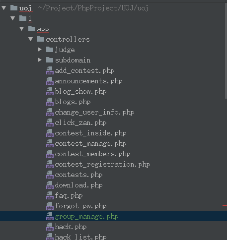
* 修改路径文件```1/app/route.php```，在博客后面添加
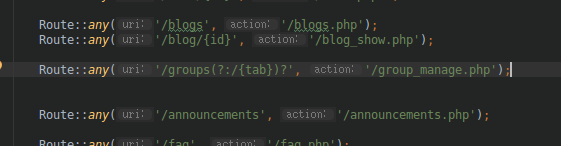
* 修改```1/app/locale/basic/en.php```与```1/app/locale/basic/zh-cn.php```
分别添加行
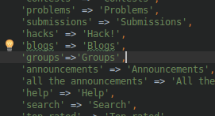
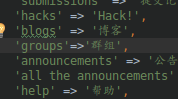
* 修改```1/app/views/main-nav.php```
添加行
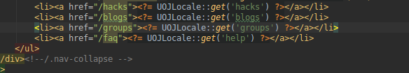
**此时已经实现基本请求映射，接下来我们编写group_manage.php**
### 2. 界面框架

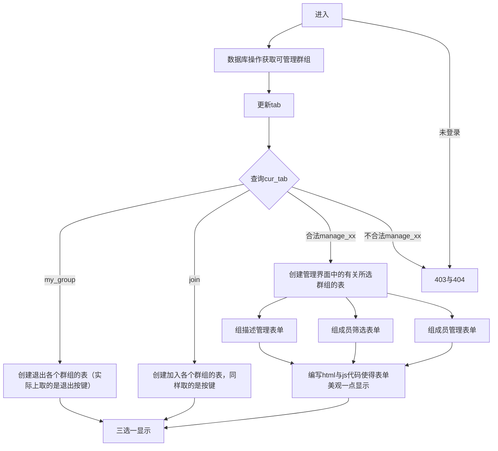

### 3. 群组页面代码
group_manage.php
```php
<?php

/**
 * Created by PhpStorm.
 * User: yaozh16
 * Date: 18-5-9
 * Time: 下午5:35
 */

requireLib('flot');
requirePHPLib('form');
if ($myUser == null ) become403Page();

$cur_tab = isset($_GET['tab']) ? $_GET['tab'] : 'my_group';
$username = $myUser['username'];
//tab条目
$tabs_info = array(
    'my_group' => array(
        'name' => '我的群组',
        'url' => '/groups/my_group'
    ),
    'join' => array(
        'name' => '加入新群组',
        'url' => '/groups/join'
    )
);
//增加管理群组条目
foreach (DB::selectAll("select * from group_info where username='{$username}' and is_admin='yes'") as $each_row) {
    $tabs_info["manage_".$each_row['group_name']] =array(
        'name' => '管理群组：'.$each_row['group_name'],
        'url' => '/groups/manage_'.$each_row['group_name']
    ) ;
}
//防止非法输入
if (!isset($tabs_info[$cur_tab])) {
    become404Page();
}


global $group_exit_forms, $group_join_forms,$group_manage_forms;

$group_manage_forms=array();//用于保存群组管理面板需要的表单
$group_exit_forms = array();//用于控制退出群组的表单
$group_join_forms = array();//用于控制加入群组的表单

//构造表单
if($cur_tab==='my_group'){
    foreach (DB::selectAll("select * from group_info where username='{$username}'") as $each_row) {
        $group_name = $each_row['group_name'];
        $username = $each_row['username'];
        $cur_group = DB::selectFirst("select * from group_description where group_name='{$group_name}'");
        $count = count(DB::selectAll("select * from group_info where group_name= '{$group_name}'"));

        $form_name = "exit_group_{$group_name}_{$username}";
        $exit_form = new UOJForm($form_name);
        $exit_form->addHidden("group_name", "$group_name", function ($str, &$vdata) {
            $vdata['group_name'] = $str;
        }, null);
        $exit_form->addHidden("username", "$username", function ($str, &$vdata) {
            $vdata['username'] = $str;
        }, null);
        $exit_form->handle = function (&$vdata) {
            $group_name = $vdata['group_name'];
            $username = $vdata['username'];
            DB::delete("delete from group_info where username='{$username}' and group_name='{$group_name}'");
        };
        $exit_form->submit_button_config['class_str'] = "btn btn-success btn-sm";
        if ($each_row['state'] == 'in')
            $exit_form->submit_button_config['text'] = "退出群组";
        else
            $exit_form->submit_button_config['text'] = "放弃申请";
        $exit_form->submit_button_config['smart_confirm'] = "yes";
        $exit_form->runAtServer();
        $group_exit_forms[$group_name] = $exit_form;
    }
}
if($cur_tab=='join'){
    foreach (DB::selectAll("select * from group_description") as $each_group) {
        if ($each_group['group_type'] == "private")
            continue;//组不开放
        if (count(DB::selectAll("select * from group_info where group_name='{$each_group['group_name']}' and username='{$username}'")) > 0)
            continue;//已经在组中
        $group_name = $each_group['group_name'];
        $group_type = $each_group['group_type'];
        $form_name = "join_group_{$group_name}_{$username}";
        $join_form = new UOJForm($form_name);
        $join_form->addHidden("group_name", "$group_name", function ($str, &$vdata) {
            $vdata['group_name'] = $str;
        }, null);
        $join_form->addHidden("username", "$username", function ($str, &$vdata) {
            $vdata['username'] = $str;
        }, null);
        $join_form->addHidden("group_type", "$group_type", function ($str, &$vdata) {
            $vdata['group_type'] = $str;
        }, null);
        if ($each_group['group_type'] == 'public')
            $join_form->submit_button_config['text'] = "加入群组";
        else if ($each_group['group_type'] == 'protected')
            $join_form->submit_button_config['text'] = "申请加入";
        $join_form->handle = function ($vdata) {
            if ($vdata['group_type'] == 'public')
                DB::insert("insert into group_info (group_name, username,is_admin, state)   values ('{$vdata['group_name']}', '{$vdata['username']}','no','in')");
            else if ($vdata['group_type'] == 'protected')
                DB::insert("insert into group_info (group_name, username,is_admin, state)   values ('{$vdata['group_name']}', '{$vdata['username']}','no','waiting')");
        };
        $join_form->runAtServer();
        $group_join_forms[$group_name] = $join_form;

    }
}
if(substr($cur_tab,0,7)==='manage_') {
    $each_row=DB::selectFirst('select * from group_info where group_name=\''.substr($cur_tab,7).'\' and username=\''.$username.'\' and state=\'in\'' );
    $group_name = $each_row['group_name'];
    $username = $each_row['username'];


    function create_description_form($each_row){
        $group_name = $each_row['group_name'];
        $username = $each_row['username'];
        $group_description=DB::selectFirst('select * from group_description where group_name=\''.$group_name.'\'');
        $group_type=$group_description['group_type'];
        $description_form_name = "type_description_{$group_name}";
        $description_form=new UOJForm($description_form_name);

        $description_form->addHidden("group_name", "$group_name", function ($str, &$vdata) {
            $vdata['group_name'] = $str;
        }, null);
        $description_form->appendHTML("<div class='table-responsive' width='100%' >");
        $description_form->appendHTML("<div style=\"width:90%;float: left; \">");
        $description_form->addSelect("group_type",array('public'=>"自由加入",'protected'=>"管理员审核",'private'=>"拒绝任何申请"),'群组类型',$group_type);
        $description_form->appendHTML("</div>");

        $description_form->appendHTML("<div style=\"width:8%;float: right;\" > ");//这里是为了button准备的
        $description_form->handle=function ($vdata){
        };
        $description_form->submit_button_config['class_str'] = "btn btn-success btn-sm";
        $description_form->submit_button_config['text'] = "修改";
        $description_form->submit_button_config['confirm_text']="确定保存当前结果吗？";
        $description_form->submit_button_config['align'] = 'right';
        $description_form->runAtServer();
        return array('form'=>$description_form,'suffix'=>"</div></div>");
    }


    function create_filter_form($each_row){
        $group_name = $each_row['group_name'];
        $username = $each_row['username'];
        $filter_form_name = "filter_group_{$group_name}";
        $filter_form = new UOJForm($filter_form_name);
        $filter_form->addHidden("group_name", "$group_name", function ($str, &$vdata) {
            $vdata['group_name'] = $str;
        }, null);
        $filter_form->addHidden("username", "$username", function ($str, &$vdata) {
            $vdata['username'] = $str;
        }, null);

        $filter_form->appendHTML("<div class='table-responsive' >");
        $filter_form->appendHTML("<div style=\"width:44%;float: left; \">");
        $filter_form->addSelect("state", array('all' => '全部', 'in' => '入群', 'waiting' => '待审'), '筛选', (isset($_GET['group_name']) && $_GET['group_name'] == $group_name && isset($_GET['state'])) ? $_GET['state'] : "all");
        $filter_form->appendHTML("</div>");
        $filter_form->appendHTML("<div style=\"width:44%;float: left;\" > ");
        $filter_form->addInput('filter_user', 'text', '字段', (isset($_GET['group_name']) && $_GET['group_name'] == $group_name) ? $_GET['filter_user'] : "",
            function ($str, &$vdata) {
                $vdata['filter_user'] = $str;
                return '';
            }, null);
        $filter_form->appendHTML("</div>");

        $filter_form->appendHTML("<div style=\"width:8%;float: right;\" > ");//这里是为了button准备的


        $filter_form->handle = function (&$vdata) use ($filter_form) {
            $filter_form->succ_href = $filter_form->succ_href . "?" . 'group_name=' . $vdata['group_name'] . '&' . 'state=' . $_POST['state'] . '&' . 'filter_user=' . $vdata['filter_user'];
        };
        $filter_form->submit_button_config['class_str'] = "btn btn-success btn-sm";
        $filter_form->submit_button_config['text'] = "筛选";
        $filter_form->submit_button_config['align'] = 'right';
        $filter_form->runAtServer();
        return array('form'=>$filter_form,'suffix'=>"</div></div>");
    }


    function create_operate_form($each_row){
        $group_name = $each_row['group_name'];
        $username = $each_row['username'];

        //实际操作
        $operate_form_name = "operate_group_{$group_name}";
        $operate_form = new  UOJForm($operate_form_name);
        $operate_form->appendHTML("<div class='table-responsive' >");
        $operate_form->appendHTML("<div id='operation_div' style=\"width:43%;display: inherit;float: left;  align-items: left;\" name='$group_name' onchange=\"switch_group_operation(this,'$group_name')\">");
        $operate_form->addSelect("group_operation", array('add' => '添加', 'del' => '删除', 'modify' => '授权'), '操作', 'add');
        $operate_form->appendHTML("</div>");
        $operate_form->appendHTML("<div style=\"width:55%;display:inherit;float: left; align-items: left;\" id='{$group_name}_suboperation_group_is_admin'> ");
        $operate_form->addSelect("group_is_admin", array(
            'yes' => "群管理员",
            'no' => "一般组员",
        ), "设置为", "no");
        $operate_form->appendHTML("</div>");
        $operate_form->appendHTML("<div style=\"width:90%;display:inherit;float: left; align-items: left;\" id='{$group_name}_suboperation_group_form_users'> ");
        $operate_form->addTextArea("group_form_users", '用户', "", function ($str, &$vdata) {
            $users = array();
            foreach (explode("\n", $str) as $line_id => $raw_line) {
                $username = trim($raw_line);//移除空格等
                if ($username == '') {
                    continue;
                }
                //检查对象是否存在
                if (!queryUser($username)) {
                    return "User {$username} 不存在，请检查输入！（出错：第{$line_id}行）";
                }
                $users[] = $username;
            }
            $vdata['users'] = $users;
            return '';
        }, null);
        $operate_form->appendHTML("</div>");
        $operate_form->appendHTML("<div style=\"display:block;float: right\" >");
        $operate_form->appendHTML('<button align="center" class="btn btn-info btn-sm" onclick="document.forms[\''.$operate_form_name.'\'].submit();">发送</button>');
        $operate_form->appendHTML("</div>");
        $operate_form->appendHTML("</div>");


        //列表题目
        $operate_form->appendHTML('<div class="table-responsive" style="display: inherit;" >');
        $operate_form->appendHTML('<table class="table table-bordered table-hover table-striped table-text-center" style="display: inherit" width="100%">');
        $operate_form->appendHTML('<thead style="min-width:100%;">');
        $operate_form->appendHTML('<tr style="width:100%;">');
        $operate_form->appendHTML('<th style="width:20em;"> rank </th>');
        $operate_form->appendHTML('<th style="width:20em;">用户名</th>');
        $operate_form->appendHTML('<th style="width:20em;">权限</th>');
        $operate_form->appendHTML('<th style="width:20em;">状态</th>');
        $operate_form->appendHTML('<th style="width:20em;">');
        $operate_form->appendHTML("<input type=\"checkbox\"  name=\"all_{$operate_form_name}\" onchange=\"select_group_all(this, '{$operate_form_name}')\">");
        $operate_form->appendHTML('</th>');
        $operate_form->appendHTML('</tr>');
        $operate_form->appendHTML('</thead>');
        $operate_form->appendHTML('<tbody>');


        //成员项
        $local_tmp_users = array();
        if (isset($_GET['group_name']) && $_GET['group_name'] == $group_name) {
            if (!isset($_GET['state']) || $_GET['state'] === 'all') {
                $local_tmp_users = DB::selectAll('select * from group_info where group_name="' . $group_name . '" and username like "' . $_GET['filter_user'] . '%"');
            } else {
                $local_tmp_users = DB::selectAll('select * from group_info where group_name="' . $group_name . '" and state=\'' . $_GET['state'] . '\' and username like "' . $_GET['filter_user'] . '%"');
            }
        } else {
            $local_tmp_users = DB::selectAll('select * from group_info where group_name="' . $group_name . '"');
        }
        if (count($local_tmp_users) > 0) {
            foreach ($local_tmp_users as $index => $local_tmp_user) {
                $operate_form->appendHTML('<tr>');
                $operate_form->appendHTML('<td>' . ($index + 1) . '</td>');
                $operate_form->appendHTML('<td>' . getUserLink($local_tmp_user['username']) . '</td>');
                $operate_form->appendHTML('<td>' . ($local_tmp_user['state'] == 'in' ? ($local_tmp_user['is_admin'] == 'yes' ? "管理员" : "组员") : "") . '</td>');
                $operate_form->appendHTML('<td>' . ($local_tmp_user['state'] == 'in' ? "已入组" : "等待审核") . '</td>');
                $operate_form->appendHTML('<td class="' . $operate_form_name . '_check_td">');
                $operate_form->addCheckBox("check_item_" . $local_tmp_user['username'], '', '');
                $operate_form->appendHTML('</td>');
                $operate_form->appendHTML('</tr>');
            }
        } else {
            $operate_form->appendHTML('<tr><td colspan="5">没有记录！</td></tr>');
        }
        $operate_form->appendHTML('</tbody>');
        $operate_form->appendHTML('</table>');
        $operate_form->appendHTML('</div>');
        $operate_form->appendHTML('<style type="text/css">button.custom_hide{display:none;}</style>');
        $operate_form->submit_button_config['text'] = '发送';
        $operate_form->submit_button_config['class_str'] = 'custom_hide';
        $operate_form->submit_button_config['smart_confirm']='yes';
        $operate_form->handle = function ($vdata) use ($group_name,$username,&$operate_form) {
            $checked = array();
            foreach ($_POST as $key => $each_item) {
                if (substr($key, 0, 11) == 'check_item_' && $each_item == 'on') {
                    $checked[] = substr($key, 11);

                };
            }
            switch ($_POST['group_operation']) {
                case 'add':
                    foreach ($vdata['users'] as $eachusername) {
                        DB::delete("delete from group_info where group_name = '{$group_name}' and username = '{$eachusername}'");
                        DB::insert("insert into group_info (group_name, username,is_admin, state)   values ('{$group_name}', '{$eachusername}','{$_POST['group_is_admin']}','in')");
                    }
                    break;
                case 'del':
                    foreach ($checked as $eachusername) {
                        if($eachusername===$username){
                            $operate_form->succ_href="/groups";
                        }
                        DB::delete("delete from group_info where group_name = '{$group_name}' and username = '{$eachusername}'");
                    }
                    break;
                case 'modify':
                    foreach ($checked as $eachusername) {
                        DB::delete("delete from group_info where group_name = '{$group_name}' and username = '{$eachusername}'");
                        DB::insert("insert into group_info (group_name, username,is_admin, state)   values ('{$group_name}', '{$eachusername}','{$_POST['group_is_admin']}','in')");
                    }
                    break;
            }
        };
        $operate_form->runAtServer();
        return array('form'=>$operate_form,'suffix'=>"");
    }


    $group_manage_forms[$group_name] = array (
            'description'=>create_description_form($each_row),
            'filter' => create_filter_form($each_row),
            'operate' => create_operate_form($each_row)
    );
}

?>
<script type="text/javascript">
    var select_group_all=function(obj,form_name) {

        console.log(obj);
        console.log(form_name + '_check_td');
        var c = document.getElementsByClassName(form_name + '_check_td');
        console.log(c.length);
        for (var i = 0; i < c.length; i++) {
            console.log(c[i].getElementsByTagName('input')[0]);
            c[i].getElementsByTagName('input')[0].checked = obj.checked;
        }
    }
</script>
<script type='text/javascript'>
    var switch_group_operation=function(obj,group_name) {
        var form_name='operate_group_'+group_name;
        var select=obj.getElementsByTagName('select')[0];
        var suboperation_group_is_admin=document.getElementById(group_name+'_suboperation_group_is_admin');
        var suboperation_group_form_users=document.getElementById(group_name+'_suboperation_group_form_users');
        var check_boxes=document.getElementsByClassName(form_name+'_check_td');
        var check_boxes_all=document.getElementsByName('all_'+form_name)[0];
        var oper=select.options[select.selectedIndex].value;
        console.log(select);
        console.log(suboperation_group_is_admin);
        console.log(suboperation_group_form_users);
        console.log(check_boxes);
        console.log(check_boxes_all);
        console.log(oper);
        switch(oper){
            case "add":
                suboperation_group_is_admin.style.display="inherit";
                suboperation_group_form_users.style.display="inherit";
                check_boxes_all.disabled=true;
                for (var i = 0; i < check_boxes.length; i++) {
                    console.log(check_boxes[i].getElementsByTagName('input')[0]);
                    check_boxes[i].getElementsByTagName('input')[0].disabled = true;
                }
                break;
            case "del":
                suboperation_group_is_admin.style.display="none";
                suboperation_group_form_users.style.display="none";
                check_boxes_all.disabled=false;
                for (var i = 0; i < check_boxes.length; i++) {
                    console.log(check_boxes[i].getElementsByTagName('input')[0]);
                    check_boxes[i].getElementsByTagName('input')[0].disabled = false;
                }

                break;
            case "modify":
                suboperation_group_is_admin.style.display="inherit";
                suboperation_group_form_users.style.display="none";
                check_boxes_all.disabled=false;
                for (var i = 0; i < check_boxes.length; i++) {
                    console.log(check_boxes[i].getElementsByTagName('input')[0]);
                    check_boxes[i].getElementsByTagName('input')[0].disabled = false;
                }
                break;
        }
    }
    window.onload=function () {
        var operation_div=document.getElementById('operation_div');
        operation_div.onchange();
    }
</script>
<?php

echoUOJPageHeader('群组管理');?>

<div class="row">
    <div class="col-sm-3">
        <?= HTML::tablist($tabs_info, $cur_tab, 'nav-pills nav-stacked') ?>
    </div>
    <div class="col-sm-9">
        <?php


        if($cur_tab=='my_group'){
            echo '<p class="list-group-item-text">';
            echo '<h6 class="list-group-item-heading">已申请加入的群组</h6>';
            function show_exit_table($username)
            {
                global $group_exit_forms;
                $header_row = '';
                $header_row .= '<tr>';
                $header_row .= '<th style="width: 5em;">群组id</th>';
                $header_row .= '<th style="width: 20em;">群组名</th>';
                $header_row .= '<th style="width: 20em;">加入状态</th>';
                $header_row .= '<th style="width: 20em;">是否是管理员</th>';
                $header_row .= '<th style="width: 20em;">群组人数</th>';
                if(Auth::check()&&Auth::id()===$username) {
                    $header_row .= '<th style="width: 10em;">操作</th>';
                }
                $header_row .= '</tr>';
                $print_row = function ($each_row, $index) use ($group_exit_forms) {
                    $group_name = $each_row['group_name'];
                    $username = $each_row['username'];
                    $cur_group = DB::selectFirst("select * from group_description where group_name='{$group_name}'");
                    $count = count(DB::selectAll("select * from group_info where group_name= '{$group_name}' and state='in'"));
                    echo '<tr>';
                    echo '<td>' . $cur_group['group_id'] . '</td>';
                    echo '<td>' . $group_name . '</td>';
                    echo '<td>' . ($each_row['state'] == 'in' ? "已入群" : "等待验证") . '</td>';
                    if($each_row['is_admin'] == 'yes' ){
                        echo '<td><a href="/groups/manage_'. $group_name .'" style="text-decoration:none;"><input type="button" value="管理" href="/groups/manage_'. $group_name .'"> </td>';
                    }else
                        echo '<td>' .  "否" . '</td>';
                    echo '<td>' . $count . '</td>';

                    if(Auth::check()&&Auth::id()==$username) {
                        echo '<td>';
                        $group_exit_forms[$group_name]->printHTML();
                        echo '</td>';
                    }
                    echo '</tr>';

                };
                $col_names = array('*');

                $config = array(
                    'echo_full' => 'yes',
                    'get_row_index' => "yes"
                );
                echoLongTable($col_names, 'group_info', 'username =\'' . $username . '\'', "", $header_row, $print_row, $config);
            }
            show_exit_table($myUser['username']);
        }
        if($cur_tab=="join"){

            echo '<h6 class="list-group-item-heading">可申请加入的群组</h6>';
            function show_join_table($username)
            {
                global $group_join_forms;
                $header_row = '';
                $header_row .= '<tr>';
                $header_row .= '<th style="width: 5em;">群组id</th>';
                $header_row .= '<th style="width: 20em;">群组名</th>';
                $header_row .= '<th style="width: 10em;">群组类型</th>';
                $header_row .= '<th style="width: 40em;">群组管理员</th>';
                $header_row .= '<th style="width: 10em;">群组人数</th>';
                $header_row .= '<th style="width: 10em;">操作</th>';
                $header_row .= '</tr>';
                $count = 0;
                $print_row = function ($each_row, $index) use ($group_join_forms, &$count, $username) {
                    if ($each_row['group_type'] == "private")
                        return;//组不开放
                    $exist = count(DB::selectAll("select * from group_info where group_name='{$each_row['group_name']}' and username='{$username}'"));
                    if ($exist > 0)
                        return;//已经在组中
                    $group_name = $each_row['group_name'];
                    $group_admins_arr = DB::selectAll('select username from group_info where group_name=\'' . $group_name . '\' and is_admin="yes"');
                    $group_admins = "";
                    foreach ($group_admins_arr as $each) {
                        if ($group_admins != '')
                            $group_admins .= ',';
                        $group_admins .= getUserLink($each['username']);
                    }
                    $count = count(DB::selectAll("select * from group_info where group_name= '{$group_name}'"));
                    echo '<tr>';
                    echo '<td>' . $each_row['group_id'] . '</td>';
                    echo '<td>' . $group_name . '</td>';
                    echo '<td>' . ($each_row['group_type'] == "public" ? "自由加入" : "需要验证") . '</td>';
                    echo '<td>' . $group_admins . '</td>';
                    echo '<td>' . $count . '</td>';
                    echo '<td>';
                    $group_join_forms[$group_name]->printHTML();
                    echo '</td>';
                    echo '</tr>';
                };
                $col_names = array('*');

                $config = array(
                    'echo_full' => 'yes',
                    'get_row_index' => "yes"
                );
                echoLongTable($col_names, 'group_description', 'group_name !=""', "", $header_row, $print_row, $config);
            }

            show_join_table($myUser['username']);
        }
        if(substr($cur_tab,0,7)==='manage_'){
            global $group_manage_forms;
            $form_array=$group_manage_forms[substr($cur_tab,7)];
            echo "<div class='operate_group_board' id='operate_{$group_name}_board' style='display:inherit;'>";

            $form_array['description']['form']->printHTML();
            echo $form_array['description']['suffix'];
            $form_array['filter']['form']->printHTML();
            echo $form_array['filter']['suffix'];
            $form_array['operate']['form']->printHTML();
            echo $form_array['operate']['suffix'];
            echo "</div>";
        }
        ?>
    </div>
</div>

<?php
echoUOJPageFooter();
?>

```

### 4. 代码分块解释
#### 1)初始校验
主要做了页面的权限控制与初始化tab列表，当期tab等
```php

requireLib('flot');
requirePHPLib('form');
if ($myUser == null ) become403Page();

$cur_tab = isset($_GET['tab']) ? $_GET['tab'] : 'my_group';
$username = $myUser['username'];
//tab条目
$tabs_info = array(
    'my_group' => array(
        'name' => '我的群组',
        'url' => '/groups/my_group'
    ),
    'join' => array(
        'name' => '加入新群组',
        'url' => '/groups/join'
    )
);
//增加可管理群组条目
foreach (DB::selectAll("select * from group_info where username='{$username}' and is_admin='yes'") as $each_row) {
    $tabs_info["manage_".$each_row['group_name']] =array(
        'name' => '管理群组：'.$each_row['group_name'],
        'url' => '/groups/manage_'.$each_row['group_name']
    ) ;
}
//防止非法输入
if (!isset($tabs_info[$cur_tab])) {
    become404Page();
}

```

#### 2)表单创建
根据当前tab的种类创建，并保存全局列表里面
```php
global $group_exit_forms, $group_join_forms,$group_manage_forms;

$group_manage_forms=array();//用于保存群组管理面板需要的表单
$group_exit_forms = array();//用于控制退出群组的表单
$group_join_forms = array();//用于控制加入群组的表单

//构造表单
if($cur_tab==='my_group'){
    foreach (DB::selectAll("select * from group_info where username='{$username}'") as $each_row) {
        $group_name = $each_row['group_name'];
        $username = $each_row['username'];
        $cur_group = DB::selectFirst("select * from group_description where group_name='{$group_name}'");
        $count = count(DB::selectAll("select * from group_info where group_name= '{$group_name}'"));

        $form_name = "exit_group_{$group_name}_{$username}";
        $exit_form = new UOJForm($form_name);
        $exit_form->addHidden("group_name", "$group_name", function ($str, &$vdata) {
            $vdata['group_name'] = $str;
        }, null);
        $exit_form->addHidden("username", "$username", function ($str, &$vdata) {
            $vdata['username'] = $str;
        }, null);
        $exit_form->handle = function (&$vdata) {
            $group_name = $vdata['group_name'];
            $username = $vdata['username'];
            DB::delete("delete from group_info where username='{$username}' and group_name='{$group_name}'");
        };
        $exit_form->submit_button_config['class_str'] = "btn btn-success btn-sm";
        if ($each_row['state'] == 'in')
            $exit_form->submit_button_config['text'] = "退出群组";
        else
            $exit_form->submit_button_config['text'] = "放弃申请";
        $exit_form->submit_button_config['smart_confirm'] = "yes";
        $exit_form->runAtServer();
        $group_exit_forms[$group_name] = $exit_form;
    }
}
if($cur_tab=='join'){
    foreach (DB::selectAll("select * from group_description") as $each_group) {
        if ($each_group['group_type'] == "private")
            continue;//组不开放
        if (count(DB::selectAll("select * from group_info where group_name='{$each_group['group_name']}' and username='{$username}'")) > 0)
            continue;//已经在组中
        $group_name = $each_group['group_name'];
        $group_type = $each_group['group_type'];
        $form_name = "join_group_{$group_name}_{$username}";
        $join_form = new UOJForm($form_name);
        $join_form->addHidden("group_name", "$group_name", function ($str, &$vdata) {
            $vdata['group_name'] = $str;
        }, null);
        $join_form->addHidden("username", "$username", function ($str, &$vdata) {
            $vdata['username'] = $str;
        }, null);
        $join_form->addHidden("group_type", "$group_type", function ($str, &$vdata) {
            $vdata['group_type'] = $str;
        }, null);
        if ($each_group['group_type'] == 'public')
            $join_form->submit_button_config['text'] = "加入群组";
        else if ($each_group['group_type'] == 'protected')
            $join_form->submit_button_config['text'] = "申请加入";
        $join_form->handle = function ($vdata) {
            if ($vdata['group_type'] == 'public')
                DB::insert("insert into group_info (group_name, username,is_admin, state)   values ('{$vdata['group_name']}', '{$vdata['username']}','no','in')");
            else if ($vdata['group_type'] == 'protected')
                DB::insert("insert into group_info (group_name, username,is_admin, state)   values ('{$vdata['group_name']}', '{$vdata['username']}','no','waiting')");
        };
        $join_form->runAtServer();
        $group_join_forms[$group_name] = $join_form;

    }
}
if(substr($cur_tab,0,7)==='manage_') {
    $each_row=DB::selectFirst('select * from group_info where group_name=\''.substr($cur_tab,7).'\' and username=\''.$username.'\' and state=\'in\'' );
    $group_name = $each_row['group_name'];
    $username = $each_row['username'];


    function create_description_form($each_row){
        $group_name = $each_row['group_name'];
        $username = $each_row['username'];
        $group_description=DB::selectFirst('select * from group_description where group_name=\''.$group_name.'\'');
        $group_type=$group_description['group_type'];
        $description_form_name = "type_description_{$group_name}";
        $description_form=new UOJForm($description_form_name);

        $description_form->addHidden("group_name", "$group_name", function ($str, &$vdata) {
            $vdata['group_name'] = $str;
        }, null);
        $description_form->appendHTML("<div class='table-responsive' width='100%' >");
        $description_form->appendHTML("<div style=\"width:90%;float: left; \">");
        $description_form->addSelect("group_type",array('public'=>"自由加入",'protected'=>"管理员审核",'private'=>"拒绝任何申请"),'群组类型',$group_type);
        $description_form->appendHTML("</div>");

        $description_form->appendHTML("<div style=\"width:8%;float: right;\" > ");//这里是为了button准备的
        $description_form->handle=function ($vdata){
        };
        $description_form->submit_button_config['class_str'] = "btn btn-success btn-sm";
        $description_form->submit_button_config['text'] = "修改";
        $description_form->submit_button_config['confirm_text']="确定保存当前结果吗？";
        $description_form->submit_button_config['align'] = 'right';
        $description_form->runAtServer();
        return array('form'=>$description_form,'suffix'=>"</div></div>");
    }


    function create_filter_form($each_row){
        $group_name = $each_row['group_name'];
        $username = $each_row['username'];
        $filter_form_name = "filter_group_{$group_name}";
        $filter_form = new UOJForm($filter_form_name);
        $filter_form->addHidden("group_name", "$group_name", function ($str, &$vdata) {
            $vdata['group_name'] = $str;
        }, null);
        $filter_form->addHidden("username", "$username", function ($str, &$vdata) {
            $vdata['username'] = $str;
        }, null);

        $filter_form->appendHTML("<div class='table-responsive' >");
        $filter_form->appendHTML("<div style=\"width:44%;float: left; \">");
        $filter_form->addSelect("state", array('all' => '全部', 'in' => '入群', 'waiting' => '待审'), '筛选', (isset($_GET['group_name']) && $_GET['group_name'] == $group_name && isset($_GET['state'])) ? $_GET['state'] : "all");
        $filter_form->appendHTML("</div>");
        $filter_form->appendHTML("<div style=\"width:44%;float: left;\" > ");
        $filter_form->addInput('filter_user', 'text', '字段', (isset($_GET['group_name']) && $_GET['group_name'] == $group_name) ? $_GET['filter_user'] : "",
            function ($str, &$vdata) {
                $vdata['filter_user'] = $str;
                return '';
            }, null);
        $filter_form->appendHTML("</div>");

        $filter_form->appendHTML("<div style=\"width:8%;float: right;\" > ");//这里是为了button准备的


        $filter_form->handle = function (&$vdata) use ($filter_form) {
            $filter_form->succ_href = $filter_form->succ_href . "?" . 'group_name=' . $vdata['group_name'] . '&' . 'state=' . $_POST['state'] . '&' . 'filter_user=' . $vdata['filter_user'];
        };
        $filter_form->submit_button_config['class_str'] = "btn btn-success btn-sm";
        $filter_form->submit_button_config['text'] = "筛选";
        $filter_form->submit_button_config['align'] = 'right';
        $filter_form->runAtServer();
        return array('form'=>$filter_form,'suffix'=>"</div></div>");
    }


    function create_operate_form($each_row){
        $group_name = $each_row['group_name'];
        $username = $each_row['username'];

        //实际操作
        $operate_form_name = "operate_group_{$group_name}";
        $operate_form = new  UOJForm($operate_form_name);
        $operate_form->appendHTML("<div class='table-responsive' >");
        $operate_form->appendHTML("<div id='operation_div' style=\"width:43%;display: inherit;float: left;  align-items: left;\" name='$group_name' onchange=\"switch_group_operation(this,'$group_name')\">");
        $operate_form->addSelect("group_operation", array('add' => '添加', 'del' => '删除', 'modify' => '授权'), '操作', 'add');
        $operate_form->appendHTML("</div>");
        $operate_form->appendHTML("<div style=\"width:55%;display:inherit;float: left; align-items: left;\" id='{$group_name}_suboperation_group_is_admin'> ");
        $operate_form->addSelect("group_is_admin", array(
            'yes' => "群管理员",
            'no' => "一般组员",
        ), "设置为", "no");
        $operate_form->appendHTML("</div>");
        $operate_form->appendHTML("<div style=\"width:90%;display:inherit;float: left; align-items: left;\" id='{$group_name}_suboperation_group_form_users'> ");
        $operate_form->addTextArea("group_form_users", '用户', "", function ($str, &$vdata) {
            $users = array();
            foreach (explode("\n", $str) as $line_id => $raw_line) {
                $username = trim($raw_line);//移除空格等
                if ($username == '') {
                    continue;
                }
                //检查对象是否存在
                if (!queryUser($username)) {
                    return "User {$username} 不存在，请检查输入！（出错：第{$line_id}行）";
                }
                $users[] = $username;
            }
            $vdata['users'] = $users;
            return '';
        }, null);
        $operate_form->appendHTML("</div>");
        $operate_form->appendHTML("<div style=\"display:block;float: right\" >");
        $operate_form->appendHTML('<button align="center" class="btn btn-info btn-sm" onclick="document.forms[\''.$operate_form_name.'\'].submit();">发送</button>');
        $operate_form->appendHTML("</div>");
        $operate_form->appendHTML("</div>");


        //列表题目
        $operate_form->appendHTML('<div class="table-responsive" style="display: inherit;" >');
        $operate_form->appendHTML('<table class="table table-bordered table-hover table-striped table-text-center" style="display: inherit" width="100%">');
        $operate_form->appendHTML('<thead style="min-width:100%;">');
        $operate_form->appendHTML('<tr style="width:100%;">');
        $operate_form->appendHTML('<th style="width:20em;"> rank </th>');
        $operate_form->appendHTML('<th style="width:20em;">用户名</th>');
        $operate_form->appendHTML('<th style="width:20em;">权限</th>');
        $operate_form->appendHTML('<th style="width:20em;">状态</th>');
        $operate_form->appendHTML('<th style="width:20em;">');
        $operate_form->appendHTML("<input type=\"checkbox\"  name=\"all_{$operate_form_name}\" onchange=\"select_group_all(this, '{$operate_form_name}')\">");
        $operate_form->appendHTML('</th>');
        $operate_form->appendHTML('</tr>');
        $operate_form->appendHTML('</thead>');
        $operate_form->appendHTML('<tbody>');


        //成员项
        $local_tmp_users = array();
        if (isset($_GET['group_name']) && $_GET['group_name'] == $group_name) {
            if (!isset($_GET['state']) || $_GET['state'] === 'all') {
                $local_tmp_users = DB::selectAll('select * from group_info where group_name="' . $group_name . '" and username like "' . $_GET['filter_user'] . '%"');
            } else {
                $local_tmp_users = DB::selectAll('select * from group_info where group_name="' . $group_name . '" and state=\'' . $_GET['state'] . '\' and username like "' . $_GET['filter_user'] . '%"');
            }
        } else {
            $local_tmp_users = DB::selectAll('select * from group_info where group_name="' . $group_name . '"');
        }
        if (count($local_tmp_users) > 0) {
            foreach ($local_tmp_users as $index => $local_tmp_user) {
                $operate_form->appendHTML('<tr>');
                $operate_form->appendHTML('<td>' . ($index + 1) . '</td>');
                $operate_form->appendHTML('<td>' . getUserLink($local_tmp_user['username']) . '</td>');
                $operate_form->appendHTML('<td>' . ($local_tmp_user['state'] == 'in' ? ($local_tmp_user['is_admin'] == 'yes' ? "管理员" : "组员") : "") . '</td>');
                $operate_form->appendHTML('<td>' . ($local_tmp_user['state'] == 'in' ? "已入组" : "等待审核") . '</td>');
                $operate_form->appendHTML('<td class="' . $operate_form_name . '_check_td">');
                $operate_form->addCheckBox("check_item_" . $local_tmp_user['username'], '', '');
                $operate_form->appendHTML('</td>');
                $operate_form->appendHTML('</tr>');
            }
        } else {
            $operate_form->appendHTML('<tr><td colspan="5">没有记录！</td></tr>');
        }
        $operate_form->appendHTML('</tbody>');
        $operate_form->appendHTML('</table>');
        $operate_form->appendHTML('</div>');
        $operate_form->appendHTML('<style type="text/css">button.custom_hide{display:none;}</style>');
        $operate_form->submit_button_config['text'] = '发送';
        $operate_form->submit_button_config['class_str'] = 'custom_hide';
        $operate_form->submit_button_config['smart_confirm']='yes';
        $operate_form->handle = function ($vdata) use ($group_name,$username,&$operate_form) {
            $checked = array();
            foreach ($_POST as $key => $each_item) {
                if (substr($key, 0, 11) == 'check_item_' && $each_item == 'on') {
                    $checked[] = substr($key, 11);

                };
            }
            switch ($_POST['group_operation']) {
                case 'add':
                    foreach ($vdata['users'] as $eachusername) {
                        DB::delete("delete from group_info where group_name = '{$group_name}' and username = '{$eachusername}'");
                        DB::insert("insert into group_info (group_name, username,is_admin, state)   values ('{$group_name}', '{$eachusername}','{$_POST['group_is_admin']}','in')");
                    }
                    break;
                case 'del':
                    foreach ($checked as $eachusername) {
                        if($eachusername===$username){
                            $operate_form->succ_href="/groups";
                        }
                        DB::delete("delete from group_info where group_name = '{$group_name}' and username = '{$eachusername}'");
                    }
                    break;
                case 'modify':
                    foreach ($checked as $eachusername) {
                        DB::delete("delete from group_info where group_name = '{$group_name}' and username = '{$eachusername}'");
                        DB::insert("insert into group_info (group_name, username,is_admin, state)   values ('{$group_name}', '{$eachusername}','{$_POST['group_is_admin']}','in')");
                    }
                    break;
            }
        };
        $operate_form->runAtServer();
        return array('form'=>$operate_form,'suffix'=>"");
    }


    $group_manage_forms[$group_name] = array (
            'description'=>create_description_form($each_row),
            'filter' => create_filter_form($each_row),
            'operate' => create_operate_form($each_row)
    );
}
```
需要注意的是，管理群组操作表单，需要很多html与js设计所以上面php代码之后需要注意js的编写
```html
<script type="text/javascript">
    var select_group_all=function(obj,form_name) {

        console.log(obj);
        console.log(form_name + '_check_td');
        var c = document.getElementsByClassName(form_name + '_check_td');
        console.log(c.length);
        for (var i = 0; i < c.length; i++) {
            console.log(c[i].getElementsByTagName('input')[0]);
            c[i].getElementsByTagName('input')[0].checked = obj.checked;
        }
    }
    var switch_group_operation=function(obj,group_name) {
        var form_name='operate_group_'+group_name;
        var select=obj.getElementsByTagName('select')[0];
        var suboperation_group_is_admin=document.getElementById(group_name+'_suboperation_group_is_admin');
        var suboperation_group_form_users=document.getElementById(group_name+'_suboperation_group_form_users');
        var check_boxes=document.getElementsByClassName(form_name+'_check_td');
        var check_boxes_all=document.getElementsByName('all_'+form_name)[0];
        var oper=select.options[select.selectedIndex].value;
        console.log(select);
        console.log(suboperation_group_is_admin);
        console.log(suboperation_group_form_users);
        console.log(check_boxes);
        console.log(check_boxes_all);
        console.log(oper);
        switch(oper){
            case "add":
                suboperation_group_is_admin.style.display="inherit";
                suboperation_group_form_users.style.display="inherit";
                check_boxes_all.disabled=true;
                for (var i = 0; i < check_boxes.length; i++) {
                    console.log(check_boxes[i].getElementsByTagName('input')[0]);
                    check_boxes[i].getElementsByTagName('input')[0].disabled = true;
                }
                break;
            case "del":
                suboperation_group_is_admin.style.display="none";
                suboperation_group_form_users.style.display="none";
                check_boxes_all.disabled=false;
                for (var i = 0; i < check_boxes.length; i++) {
                    console.log(check_boxes[i].getElementsByTagName('input')[0]);
                    check_boxes[i].getElementsByTagName('input')[0].disabled = false;
                }

                break;
            case "modify":
                suboperation_group_is_admin.style.display="inherit";
                suboperation_group_form_users.style.display="none";
                check_boxes_all.disabled=false;
                for (var i = 0; i < check_boxes.length; i++) {
                    console.log(check_boxes[i].getElementsByTagName('input')[0]);
                    check_boxes[i].getElementsByTagName('input')[0].disabled = false;
                }
                break;
        }
    }
    window.onload=function () {
        var operation_div=document.getElementById('operation_div');
        operation_div.onchange();
    }
</script>
```
#### 3)通用框架
```php
<?php
echoUOJPageHeader('群组管理');
?>
<div class="row">
    <div class="col-sm-3">
    <!--边栏-->
        <?= HTML::tablist($tabs_info, $cur_tab, 'nav-pills nav-stacked') ?>
    </div>
    <div class="col-sm-9">
    <!--右边主页面-->
    <?php    
     ?>
    </div>
</div>
<?php
echoUOJPageFooter();
?>
```
#### 4)右边操作界面代码
```php 

        if($cur_tab=='my_group'){
            echo '<p class="list-group-item-text">';
            echo '<h6 class="list-group-item-heading">已申请加入的群组</h6>';
            function show_exit_table($username)
            {
                global $group_exit_forms;
                $header_row = '';
                $header_row .= '<tr>';
                $header_row .= '<th style="width: 5em;">群组id</th>';
                $header_row .= '<th style="width: 20em;">群组名</th>';
                $header_row .= '<th style="width: 20em;">加入状态</th>';
                $header_row .= '<th style="width: 20em;">是否是管理员</th>';
                $header_row .= '<th style="width: 20em;">群组人数</th>';
                if(Auth::check()&&Auth::id()===$username) {
                    $header_row .= '<th style="width: 10em;">操作</th>';
                }
                $header_row .= '</tr>';
                $print_row = function ($each_row, $index) use ($group_exit_forms) {
                    $group_name = $each_row['group_name'];
                    $username = $each_row['username'];
                    $cur_group = DB::selectFirst("select * from group_description where group_name='{$group_name}'");
                    $count = count(DB::selectAll("select * from group_info where group_name= '{$group_name}' and state='in'"));
                    echo '<tr>';
                    echo '<td>' . $cur_group['group_id'] . '</td>';
                    echo '<td>' . $group_name . '</td>';
                    echo '<td>' . ($each_row['state'] == 'in' ? "已入群" : "等待验证") . '</td>';
                    if($each_row['is_admin'] == 'yes' ){
                        echo '<td><a href="/groups/manage_'. $group_name .'" style="text-decoration:none;"><input type="button" value="管理" href="/groups/manage_'. $group_name .'"> </td>';
                    }else
                        echo '<td>' .  "否" . '</td>';
                    echo '<td>' . $count . '</td>';

                    if(Auth::check()&&Auth::id()==$username) {
                        echo '<td>';
                        $group_exit_forms[$group_name]->printHTML();
                        echo '</td>';
                    }
                    echo '</tr>';

                };
                $col_names = array('*');

                $config = array(
                    'echo_full' => 'yes',
                    'get_row_index' => "yes"
                );
                echoLongTable($col_names, 'group_info', 'username =\'' . $username . '\'', "", $header_row, $print_row, $config);
            }
            show_exit_table($myUser['username']);
        }
        if($cur_tab=="join"){

            echo '<h6 class="list-group-item-heading">可申请加入的群组</h6>';
            function show_join_table($username)
            {
                global $group_join_forms;
                $header_row = '';
                $header_row .= '<tr>';
                $header_row .= '<th style="width: 5em;">群组id</th>';
                $header_row .= '<th style="width: 20em;">群组名</th>';
                $header_row .= '<th style="width: 10em;">群组类型</th>';
                $header_row .= '<th style="width: 40em;">群组管理员</th>';
                $header_row .= '<th style="width: 10em;">群组人数</th>';
                $header_row .= '<th style="width: 10em;">操作</th>';
                $header_row .= '</tr>';
                $count = 0;
                $print_row = function ($each_row, $index) use ($group_join_forms, &$count, $username) {
                    if ($each_row['group_type'] == "private")
                        return;//组不开放
                    $exist = count(DB::selectAll("select * from group_info where group_name='{$each_row['group_name']}' and username='{$username}'"));
                    if ($exist > 0)
                        return;//已经在组中
                    $group_name = $each_row['group_name'];
                    $group_admins_arr = DB::selectAll('select username from group_info where group_name=\'' . $group_name . '\' and is_admin="yes"');
                    $group_admins = "";
                    foreach ($group_admins_arr as $each) {
                        if ($group_admins != '')
                            $group_admins .= ',';
                        $group_admins .= getUserLink($each['username']);
                    }
                    $count = count(DB::selectAll("select * from group_info where group_name= '{$group_name}'"));
                    echo '<tr>';
                    echo '<td>' . $each_row['group_id'] . '</td>';
                    echo '<td>' . $group_name . '</td>';
                    echo '<td>' . ($each_row['group_type'] == "public" ? "自由加入" : "需要验证") . '</td>';
                    echo '<td>' . $group_admins . '</td>';
                    echo '<td>' . $count . '</td>';
                    echo '<td>';
                    $group_join_forms[$group_name]->printHTML();
                    echo '</td>';
                    echo '</tr>';
                };
                $col_names = array('*');

                $config = array(
                    'echo_full' => 'yes',
                    'get_row_index' => "yes"
                );
                echoLongTable($col_names, 'group_description', 'group_name !=""', "", $header_row, $print_row, $config);
            }

            show_join_table($myUser['username']);
        }
        if(substr($cur_tab,0,7)==='manage_'){
            global $group_manage_forms;
            $form_array=$group_manage_forms[substr($cur_tab,7)];
            echo "<div class='operate_group_board' id='operate_{$group_name}_board' style='display:inherit;'>";

            $form_array['description']['form']->printHTML();
            echo $form_array['description']['suffix'];
            $form_array['filter']['form']->printHTML();
            echo $form_array['filter']['suffix'];
            $form_array['operate']['form']->printHTML();
            echo $form_array['operate']['suffix'];
            echo "</div>";
        }
```
### 5. 效果预览
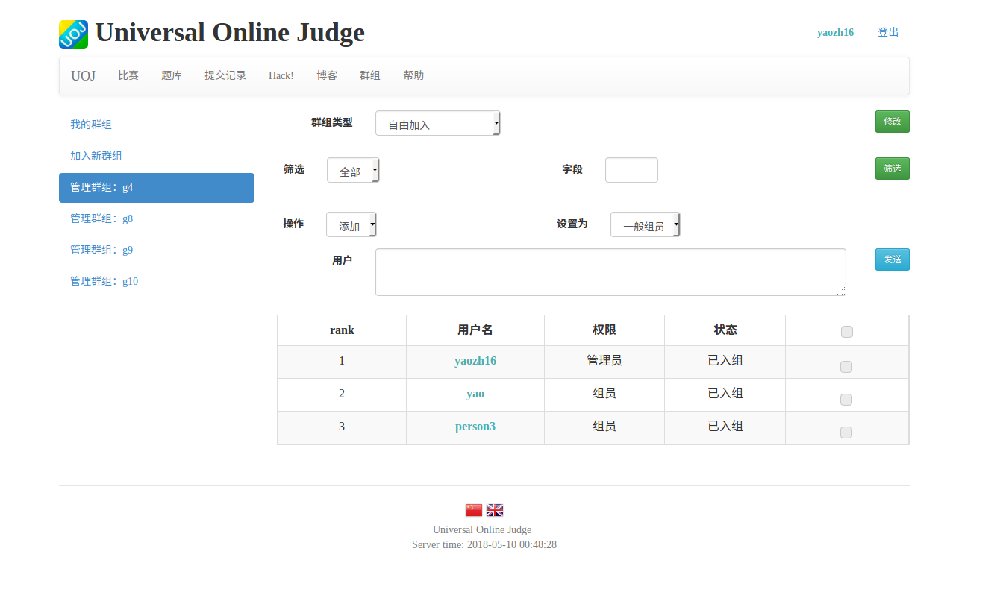
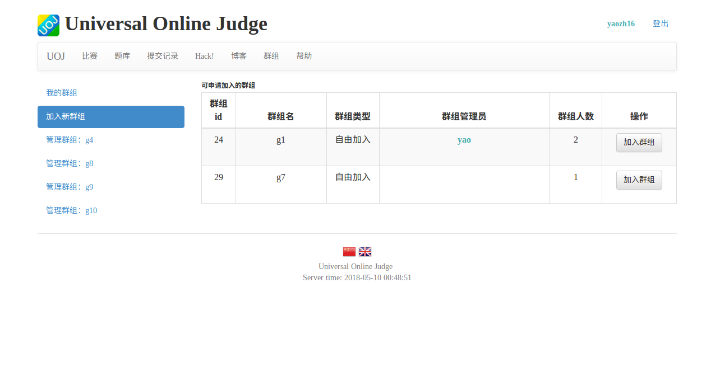
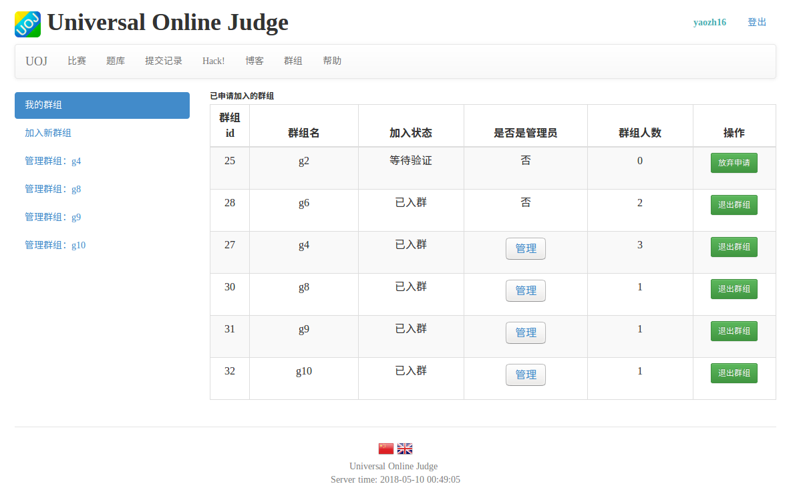
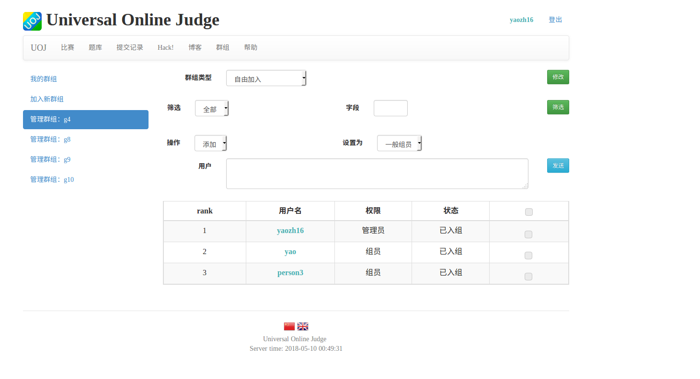
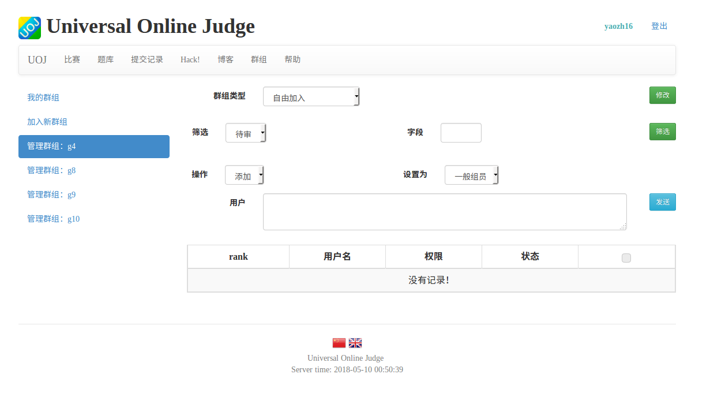
### 6.后记
* 目前实现的界面暂时只支持系统管理员建组
* 除了后台数据库操作，无法删除组
* 可以拓展的内容：
1. 在组的描述中增加修改组的一些内容项的作用，例如组公告，组描述文本，但是目前这些由于数据量比较大，不确定是否要放到数据库里
2. 在加入组界面增加筛选组的功能

_完成时间：2018-05-09 姚振翮_