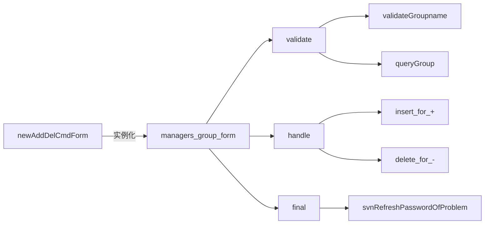
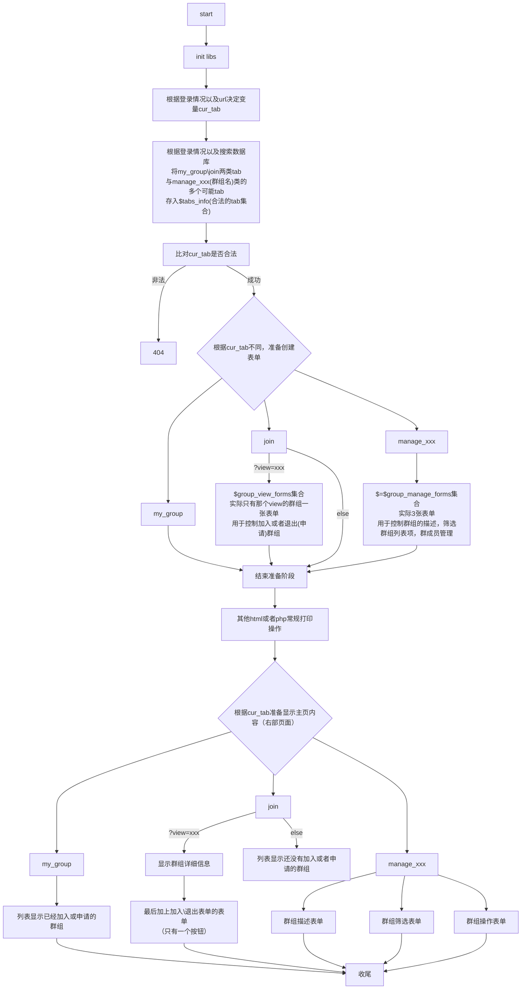

#群组功能开发文档
姚振翮 2018/6/20
代码见github仓库
#〇、目录
[一、有关文件](#一-有关文件)
[二、修改或新增部分说明](#二-修改或新增部分说明)
&emsp;&emsp;[1.数据库](#1数据库)
&emsp;&emsp;[2.problem_managers_manage问题管理](#2problem_managers_manage问题管理)
&emsp;&emsp;[3.group_manage群组管理](#3group_manage群组管理)
#一、有关文件

* uoj/1/app/uoj-validate_lib.php
* uoj/1/app/uoj-query_lib.php
* uoj/1/app/controllers/group_manage.php
* uoj/1/app/controllers/user_info.php
* uoj/1/app/controllers/problem_managers_manage.php

#二、修改或新增部分说明
## 1.数据库
数据库利用两张表
### 第一张group_info表示用户与群组之间关系
* group_info与例子

| group_name | username  | is_admin | state   | other_config |
|:-----------|:----------|:---------|:--------|:-------------|
| class1     | TA        | yes      | in      |              |
| class1     | student_X | no       | in      |              |
| class2     | student_X | no       | waiting |              |

* group_description与例子

| group_id | group_name | group_type | other_config |
|:---------|:-----------|:-----------|:-------------|
| 1        | TA         | public     |              |

* 说明

| group_type | 说明                           |
|:-----------|:-------------------------------|
| public     | 自由加入                       |
| protected  | 申请需要群组管理员认证加入     |
| private    | 不允许加入(只能管理员手动加入) |

| is_admin | 说明           |
|:---------|:---------------|
| yes      | 是群组管理员   |
| no       | 不是群组管理员 |


| state   | 说明                        |
|:--------|:----------------------------|
| in      | 在群组中                    |
| waiting | 仅在protected使用，等待认证 |

* sql结构如下
```sql
use app_uoj233;
CREATE TABLE IF NOT EXISTS `group_description`(
   `group_id` INT UNSIGNED AUTO_INCREMENT,
   `group_name` VARCHAR(100) NOT NULL,
   `group_type` VARCHAR(40) NOT NULL,
   `other_config` VARCHAR(5000) NOT NULL,
   PRIMARY KEY ( `group_id` )
)ENGINE=InnoDB DEFAULT CHARSET=utf8;
CREATE TABLE IF NOT EXISTS `group_info`(
   `group_name` VARCHAR(100) NOT NULL,
   `username` VARCHAR(40) NOT NULL,
   `is_admin` VARCHAR(5) NOT NULL,
   `state` VARCHAR(10) NOT NULL,
   `other_config` VARCHAR(1000) NOT NULL
)ENGINE=InnoDB DEFAULT CHARSET=utf8;
```

##2.problem_managers_manage问题管理
新增部分主要表单内容


##3.group_manage群组管理
页面生成流程

